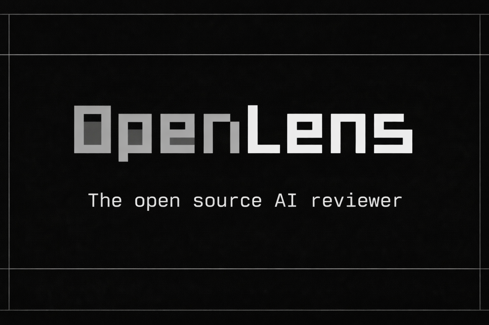

<p align="center">
  
</p>

# openlens

An open source AI code reviewer. agents review your git diffs in parallel for security, bugs, performance, and style issues.

## Where it runs

- **Terminal**: `openlens run --staged` before you commit
- **Git hooks**: `openlens hooks install` adds pre-commit and pre-push hooks that block on critical issues
- **Platform hooks**: intercept `git commit`/`git push` inside Claude Code, Codex, Gemini CLI, and OpenCode before they execute
- **GitHub Actions**: posts inline review comments on the exact lines, resolves them when you push fixes
- **AI coding agents**: `/openlens` in Claude Code, `$openlens` in Codex, `/openlens` in Gemini CLI, native plugin in OpenCode
- **Your own tools**: TypeScript library API with 30+ exports, HTTP server, SARIF output

Built on [OpenCode](https://github.com/anomalyco/opencode).

## Features

- **Parallel Agent Execution**: Run security, bug, performance, and style agents concurrently
- **Full Codebase Access**: Agents can read, grep, and glob your project -not just the diff
- **Confidence Scoring**: Agents assess confidence per finding -filter noise with configurable thresholds
- **Smart Context**: Per-agent context strategies auto-gather relevant files (auth modules, callers, linter configs)
- **Multiple AI Providers**: Any model supported by OpenCode (Anthropic, OpenAI, Google, AWS Bedrock, Groq, and more)
- **CI/CD**: First-class CI/CD integration with GitHub Actions, GitLab CI, and other tools
- **Inline PR Comments**: GitHub Action posts review comments on exact lines, not just a summary
- **Suppression Rules**: Glob patterns and `.openlensignore` to silence known noise
- **Customizable Agents**: Write your own review agents with markdown prompts and YAML frontmatter
- **Library & Plugin API**: Use as a CLI, HTTP server, library import, or OpenCode plugin
- **Platform Plugins**: Native integrations for Claude Code, Codex CLI, and Gemini CLI — `openlens setup` installs both the slash command and a `using-openlens` usage guide skill
- **Git Hooks**: Pre-commit and pre-push hooks block critical issues before they land
- **Platform Hooks**: Intercept `git commit`/`git push` inside Claude Code, Codex, Gemini CLI, and OpenCode
- **Built-in Docs**: `openlens docs` serves a full wiki locally with dark theme and diagrams
- **Event Bus**: Subscribe to review lifecycle events for custom integrations

## Installation

```bash
# Install from npm
npm install -g openlens

# Verify
openlens --version
```

### From Source

```bash
git clone https://github.com/Traves-Theberge/OpenLens.git
cd OpenLens
bun install
bun run build
bun link
openlens run
```

## Quick Start

```bash
# Interactive project setup (config, agents, hooks, plugins, CI/CD)
openlens setup

# Or quick init (config + agents only)
openlens init

# Review staged changes
openlens run --staged

# Review against main branch
openlens run --branch main

# Run only security and bug agents
openlens run --agents security,bugs

# Preview what would run
openlens run --dry-run

# Output SARIF for CI
openlens run --format sarif > results.sarif
```

## Configuration

openlens looks for configuration in these locations (last wins):

1. Built-in defaults
2. `~/.config/openlens/openlens.json` (global)
3. `./openlens.json` or `./openlens.jsonc` (project root)
4. Environment variables (`OPENLENS_MODEL`, `OPENLENS_PORT`)
5. CI environment defaults (auto-detected)

### Configuration File Structure

```json
{
  "$schema": "https://openlens.dev/config.json",

  "model": "opencode/big-pickle",

  "agent": {
    "security": {
      "description": "Security vulnerability scanner",
      "mode": "subagent",
      "model": "opencode/big-pickle",
      "prompt": "{file:./agents/security.md}",
      "steps": 5,
      "permission": {
        "read": "allow",
        "grep": "allow",
        "glob": "allow",
        "list": "allow",
        "lsp": "allow",
        "edit": "deny",
        "write": "deny",
        "bash": "deny"
      }
    },
    "bugs": {
      "description": "Bug and logic error detector",
      "mode": "subagent",
      "prompt": "{file:./agents/bugs.md}",
      "steps": 5
    },
    "performance": {
      "description": "Performance issue finder",
      "mode": "subagent",
      "prompt": "{file:./agents/performance.md}",
      "steps": 5
    },
    "style": {
      "description": "Style and convention checker",
      "mode": "subagent",
      "prompt": "{file:./agents/style.md}",
      "steps": 3
    }
  },

  "permission": {
    "read": "allow",
    "grep": "allow",
    "glob": "allow",
    "list": "allow",
    "lsp": "allow",
    "skill": "allow",
    "edit": "deny",
    "write": "deny",
    "patch": "deny",
    "bash": "deny"
  },

  "review": {
    "defaultMode": "staged",
    "instructions": ["REVIEW.md"],
    "baseBranch": "main",
    "fullFileContext": true,
    "verify": true,
    "minConfidence": "medium",
    "timeoutMs": 180000,
    "maxConcurrency": 4
  },

  "suppress": {
    "files": ["generated/**", "vendor/**"],
    "patterns": []
  },

  "server": {
    "port": 4096,
    "hostname": "localhost"
  },

  "mcp": {},

  "disabled_agents": []
}
```

### Permission System

Permissions control what tools each agent can use. Three values are supported:

| Value     | Behavior                        |
| --------- | ------------------------------- |
| `"allow"` | Tool executes without approval  |
| `"deny"`  | Tool is blocked                 |
| `"ask"`   | Requires user confirmation      |

Permissions are inherited in layers (last wins):

1. Built-in defaults (read-only codebase access)
2. Global `permission` block in config
3. YAML frontmatter in the agent's `.md` file
4. Agent-specific `permission` in config

#### Granular Patterns

For fine-grained control, use pattern matching on tools like `bash`:

```json
{
  "permission": {
    "bash": {
      "git *": "allow",
      "rm *": "deny",
      "*": "ask"
    }
  }
}
```

### Available Tools

| Tool          | Description                          |
| ------------- | ------------------------------------ |
| `read`        | Read file contents                   |
| `edit`        | Modify files (exact string replace)  |
| `write`       | Create or overwrite files            |
| `glob`        | Find files by pattern                |
| `grep`        | Search file contents (regex)         |
| `list`        | List directory contents              |
| `bash`        | Execute shell commands               |
| `patch`       | Apply patch files to codebase        |
| `lsp`         | LSP code intelligence (experimental) |
| `webfetch`    | Fetch data from URLs                 |
| `websearch`   | Search the web                       |
| `task`        | Run sub-tasks with a subagent        |
| `skill`       | Load reusable skill instructions     |
| `codesearch`  | Search code across repositories      |

### Review Options

| Option              | Type     | Default        | Description                                   |
| ------------------- | -------- | -------------- | --------------------------------------------- |
| `defaultMode`       | string   | `"staged"`     | Default diff mode: staged, unstaged, branch, auto |
| `instructions`      | string[] | `["REVIEW.md"]`| Files with project-specific review guidance    |
| `baseBranch`        | string   | `"main"`       | Base branch for branch-mode diffs              |
| `fullFileContext`    | boolean  | `true`         | Include full source of changed files           |
| `verify`            | boolean  | `true`         | Run verification pass to filter false positives|
| `timeoutMs`         | number   | `180000`       | Timeout per agent in milliseconds              |
| `minConfidence`     | string   | `"medium"`     | Minimum confidence level to report (high/medium/low) |
| `maxConcurrency`    | number   | `4`            | Max agents running in parallel                 |

### Suppression

Suppress known noise with glob patterns and text matching:

```json
{
  "suppress": {
    "files": ["generated/**", "vendor/**", "*.min.js"],
    "patterns": ["TODO", "FIXME"]
  }
}
```

Or use a `.openlensignore` file (one pattern per line, `#` for comments):

```
generated/**
vendor/**
# Ignore test fixtures
test/fixtures/**
```

## Agents

openlens ships with four built-in agents. Each is a markdown file with YAML frontmatter in the `agents/` directory.

### Built-in Agents

| Agent           | Focus                      | Default Model                          |
| --------------- | -------------------------- | -------------------------------------- |
| `security`      | Vulnerabilities & secrets  | `opencode/big-pickle`   |
| `bugs`          | Logic errors & edge cases  | `opencode/big-pickle`   |
| `performance`   | N+1 queries, bottlenecks   | `opencode/big-pickle`   |
| `style`         | Conventions & dead code    | `opencode/big-pickle`   |

### Creating Custom Agents

Create a markdown file in `agents/` with YAML frontmatter:

```markdown
---
description: Accessibility checker
mode: subagent
model: opencode/big-pickle
steps: 5
permission:
  read: allow
  grep: allow
  glob: allow
  list: allow
  lsp: allow
  edit: deny
  write: deny
  bash: deny
---

You are an accessibility-focused code reviewer.

## What to look for

- Missing ARIA labels on interactive elements
- Insufficient color contrast ratios
- Missing alt text on images
- Keyboard navigation issues
- Screen reader compatibility

## Output

Return a JSON array of issues:

\`\`\`json
[
  {
    "file": "src/Button.tsx",
    "line": 12,
    "severity": "warning",
    "title": "Missing aria-label on icon button",
    "message": "Icon-only buttons need an aria-label for screen readers.",
    "fix": "Add aria-label=\"Close\" to the button element"
  }
]
\`\`\`

If no issues found, return `[]`
```

Then reference it in your config:

```json
{
  "agent": {
    "a11y": {
      "description": "Accessibility checker",
      "prompt": "{file:./agents/a11y.md}"
    }
  }
}
```

Or use `openlens agent create`:

```bash
openlens agent create a11y --description "Accessibility checker"
```

### Agent Configuration Fields

| Field          | Type                                   | Default       | Description                          |
| -------------- | -------------------------------------- | ------------- | ------------------------------------ |
| `description`  | string                                 | -            | Human-readable description           |
| `mode`         | `"primary"` \| `"subagent"` \| `"all"` | `"subagent"` | When the agent can run               |
| `model`        | string                                 | Global model  | Provider/model-id (e.g. `opencode/big-pickle`) |
| `prompt`       | string                                 | -            | Inline text or `{file:./path.md}`    |
| `steps`        | number                                 | `5`           | Max agentic loop iterations          |
| `temperature`  | number                                 | -            | Sampling temperature (0–1)           |
| `top_p`        | number                                 | -            | Nucleus sampling (0–1)               |
| `disable`      | boolean                                | `false`       | Turn off without deleting            |
| `hidden`       | boolean                                | `false`       | Hide from listings (subagents only)  |
| `color`        | string                                 | -            | Hex color or theme name              |
| `context`      | string                                 | -            | Context strategy: security, bugs, performance, style |
| `permission`   | object                                 | Read-only     | Tool permissions for this agent      |

## CLI Reference

### Commands

```
openlens run                    Run code review
openlens setup                  Interactive project setup wizard
openlens init                   Initialize in current project
openlens agent list             List configured agents
openlens agent create <name>    Create a new review agent
openlens agent test <name>      Test a single agent on current changes
openlens agent validate         Validate all agent configurations
openlens agent enable <name>    Re-enable a disabled agent
openlens agent disable <name>   Disable an agent
openlens hooks install           Install git hooks (pre-commit + pre-push)
openlens hooks remove            Remove git hooks (restores backups)
openlens docs                   Open documentation in your browser
openlens serve                  Start HTTP server
openlens models                 List available models from OpenCode
openlens doctor                 Check environment and configuration
```

### `openlens run`

| Flag               | Short | Description                                      |
| ------------------ | ----- | ------------------------------------------------ |
| `--staged`         |       | Review staged changes                            |
| `--unstaged`       |       | Review unstaged changes                          |
| `--branch <name>`  |       | Review diff against a branch (default: main)     |
| `--agents <list>`  |       | Comma-separated agent whitelist                  |
| `--exclude-agents` |       | Comma-separated agents to skip                   |
| `--model <id>`     | `-m`  | Override model for all agents                    |
| `--format <fmt>`   | `-f`  | Output format: `text`, `json`, `sarif`, `markdown` |
| `--no-verify`      |       | Skip the verification pass                       |
| `--no-context`     |       | Skip full file context (diff only)               |
| `--dry-run`        |       | Show what would run without making API calls      |

### `openlens agent create`

| Flag               | Description                                      |
| ------------------ | ------------------------------------------------ |
| `--description`    | Agent description                                |
| `--model`          | Model to use (e.g. `opencode/big-pickle`) |
| `--steps`          | Max agentic loop iterations (default: 5)         |

### `openlens agent test`

| Flag               | Short | Description                                      |
| ------------------ | ----- | ------------------------------------------------ |
| `--staged`         |       | Review staged changes                            |
| `--unstaged`       |       | Review unstaged changes                          |
| `--branch <name>`  |       | Review diff against branch                       |
| `--model <id>`     | `-m`  | Override model                                   |
| `--format <fmt>`   |       | Output format: `text`, `json`                    |
| `--verbose`        |       | Show timing and metadata (default: true)         |

### `openlens serve`

| Flag            | Description                                      |
| --------------- | ------------------------------------------------ |
| `--port`        | Server port (default: from config, or 4096)      |
| `--hostname`    | Server hostname (default: localhost)              |

### `openlens doctor`

Validates your environment: git, OpenCode binary, API keys, config file, agent configurations, and CI detection. No flags needed.

### Exit Codes

| Code | Meaning                    |
| ---- | -------------------------- |
| `0`  | No critical issues found   |
| `1`  | Critical issues detected   |
| `2`  | Runtime error              |

## HTTP API

Start the server with `openlens serve`, then:

| Method | Endpoint    | Description                     |
| ------ | ----------- | ------------------------------- |
| `GET`  | `/`         | Version info                    |
| `POST` | `/review`   | Run a review                    |
| `GET`  | `/agents`   | List configured agents          |
| `GET`  | `/config`   | Current config (secrets stripped)|
| `GET`  | `/diff`     | Diff statistics                 |
| `GET`  | `/health`   | Health check                    |

### `POST /review`

```json
{
  "agents": ["security", "bugs"],
  "mode": "staged",
  "branch": "main",
  "verify": true,
  "fullFileContext": true
}
```

### Response

```json
{
  "issues": [
    {
      "file": "src/auth.ts",
      "line": 42,
      "severity": "critical",
      "agent": "security",
      "title": "SQL injection via unsanitized input",
      "confidence": "high",
      "message": "The username parameter is interpolated directly into the SQL query.",
      "fix": "Use a prepared statement.",
      "patch": "-db.query(`SELECT * FROM users WHERE name = '${username}'`)\n+db.query('SELECT * FROM users WHERE name = $1', [username])"
    }
  ],
  "timing": {
    "security": 4200,
    "bugs": 3800
  },
  "meta": {
    "mode": "staged",
    "filesChanged": 3,
    "agentsRun": 2,
    "agentsFailed": 0,
    "suppressed": 0,
    "verified": true
  }
}
```

## Output Formats

### Text (default)

Colorized console output with severity indicators, file locations, and suggested fixes. Respects the `NO_COLOR` environment variable.

### JSON

Full structured output including issues, timing, and metadata. Suitable for programmatic consumption.

### SARIF

[Static Analysis Results Interchange Format](https://sarifweb.azurewebsites.net/) v2.1.0. Upload directly to GitHub Code Scanning, GitLab SAST, or any SARIF-compatible tool.

```bash
# GitHub Actions example
openlens run --format sarif > results.sarif
gh api repos/{owner}/{repo}/code-scanning/sarifs \
  --method POST \
  --field sarif=@results.sarif
```

## Library API

Use openlens programmatically:

```typescript
import { runReview, loadConfig, getDiff, formatSarif } from "openlens"

const config = await loadConfig()
const result = await runReview(config, "staged")

console.log(formatSarif(result))
```

### Exports

| Export                | Type       | Description                          |
| --------------------- | ---------- | ------------------------------------ |
| `runReview`           | function   | Run a full review                    |
| `runSingleAgentReview`| function   | Run a single agent review (delegation) |
| `loadConfig`          | function   | Load and validate config             |
| `loadInstructions`    | function   | Load project instruction files       |
| `loadAgents`          | function   | Load and resolve agent configs       |
| `filterAgents`        | function   | Whitelist agents by name             |
| `excludeAgents`       | function   | Exclude agents by name               |
| `getDiff`             | function   | Get diff from git                    |
| `getAutoDetectedDiff` | function   | Auto-detect diff mode                |
| `getDiffStats`        | function   | Parse diff statistics                |
| `formatText`          | function   | Format results as text               |
| `formatJson`          | function   | Format results as JSON               |
| `formatSarif`         | function   | Format results as SARIF              |
| `loadSuppressRules`   | function   | Load suppression rules               |
| `shouldSuppress`      | function   | Check if an issue should be suppressed|
| `createBus`           | function   | Create an event bus                  |
| `bus`                 | instance   | Default event bus                    |
| `createServer`        | function   | Create the HTTP server               |
| `detectCI`            | function   | Detect CI environment                |
| `resolveOpencodeBin`  | function   | Resolve OpenCode binary path         |
| `inferBaseBranch`     | function   | Infer base branch from CI env        |
| `Issue`               | type       | Issue schema                         |
| `ReviewResult`        | type       | Review result schema                 |
| `Config`              | type       | Configuration schema                 |
| `AgentConfig`         | type       | Agent config schema                  |
| `Agent`               | type       | Resolved agent type                  |
| `ReviewEvents`        | type       | Event bus event types                |
| `SuppressRule`        | type       | Suppression rule type                |
| `formatGitHubReview`  | function   | Format results as GitHub PR review payload |
| `gatherStrategyContext`| function  | Gather context files per agent strategy |
| `filterByConfidence`  | function   | Filter issues by confidence threshold |
| `GitHubReview`        | type       | GitHub PR review payload type        |
| `GitHubReviewComment` | type       | GitHub PR review comment type        |

## Add openlens to Your Project

openlens integrates with all major AI coding platforms. Pick your platform:

### Claude Code

```bash
# Symlink from the repo (stays in sync)
ln -s /path/to/openlens/plugins/claude-code ~/.claude/skills/openlens

# Or copy from npm package
cp -r node_modules/openlens/plugins/claude-code ~/.claude/skills/openlens
```

Then use `/openlens` in any Claude Code session.

The setup wizard also installs a `using-openlens` skill that teaches Claude Code how to use the CLI effectively.

### Codex CLI

```bash
# Copy the skill
cp -r /path/to/openlens/plugins/codex ~/.codex/skills/openlens
```

Then use `$openlens` in Codex. Requires `codex --full-auto` or approving network access.

The setup wizard also installs a `using-openlens` skill that teaches Codex how to use the CLI effectively.

### Gemini CLI

```bash
# Add to your project
mkdir -p .gemini/commands
cp /path/to/openlens/plugins/gemini/openlens.toml .gemini/commands/

# Or add globally
cp /path/to/openlens/plugins/gemini/openlens.toml ~/.gemini/commands/
```

Then use `/openlens` in Gemini CLI.

### OpenCode

Add to your `opencode.json`:

```json
{
  "plugin": ["openlens"]
}
```

This registers four tools:

| Tool                    | Description                          |
| ----------------------- | ------------------------------------ |
| `openlens`              | Run a full review                    |
| `openlens-delegate`     | Delegate to a specialist agent       |
| `openlens-conventions`  | Get project review instructions      |
| `openlens-agents`       | List available agents                |

## Hooks

openlens hooks automate code review on every commit and push -both from your terminal and from AI coding agents.

### Git Hooks

```bash
openlens hooks install    # pre-commit + pre-push
openlens hooks remove     # restore originals
```

| Hook | Agents | Behavior |
| ---- | ------ | -------- |
| `pre-commit` | security, bugs | Blocks commit on critical issues |
| `pre-push` | all agents | Blocks push on critical issues |

```bash
OPENLENS_SKIP=1 git commit -m "wip"           # skip hooks
OPENLENS_AGENTS=security git commit -m "fix"   # customize agents
```

### Platform Hooks

Ready-made hook configs for all 4 AI coding platforms. Each blocks `git commit`/`git push` on critical issues:

```bash
# Claude Code
cp hooks/claude-code-hooks.json .claude/settings.json

# Gemini CLI
cp hooks/gemini-hooks.json .gemini/settings.json

# Codex CLI
mkdir -p .codex && cp hooks/codex-hooks.json .codex/hooks.json

# OpenCode -copy hooks/opencode-hooks.ts into your plugin
```

`openlens setup` installs both the platform slash command and the `using-openlens` usage guide skill for Claude Code and Codex.

See the [Hooks Guide](docs/guides/hooks-guide.md) for full details on each platform.

## Event Bus

Subscribe to review lifecycle events for custom integrations:

```typescript
import { createBus } from "openlens"

const bus = createBus()

bus.subscribe("agent.started", ({ name }) => {
  console.log(`Agent ${name} started`)
})

bus.subscribe("agent.completed", ({ name, issueCount, time }) => {
  console.log(`Agent ${name} found ${issueCount} issues in ${time}ms`)
})

bus.subscribe("review.completed", ({ issueCount, time }) => {
  console.log(`Review complete: ${issueCount} issues in ${time}ms`)
})
```

### Events

| Event               | Data                                     |
| ------------------- | ---------------------------------------- |
| `review.started`    | `{ agents: string[] }`                   |
| `agent.started`     | `{ name: string }`                       |
| `agent.completed`   | `{ name: string, issueCount: number, time: number }` |
| `agent.progress`    | `{ name: string, kind: string, detail: string }` |
| `agent.failed`      | `{ name: string, error: string }`        |
| `review.completed`  | `{ issueCount: number, time: number }`   |

## MCP (Model Context Protocol)

openlens supports MCP servers for extending agent capabilities:

```json
{
  "mcp": {
    "example": {
      "type": "local",
      "command": "path/to/mcp-server",
      "args": ["--port", "3001"],
      "environment": {
        "API_KEY": "your-key"
      },
      "enabled": true
    }
  }
}
```

## Architecture

```
src/
├── index.ts              # CLI entry point (yargs)
├── lib.ts                # Public library exports
├── plugin.ts             # OpenCode plugin integration
├── types.ts              # Zod schemas & types
├── env.ts                # CI detection & binary resolution
├── suppress.ts           # Suppression rules
├── agent/
│   └── agent.ts          # Agent loading & config merging
├── bus/
│   └── index.ts          # Event bus
├── config/
│   ├── schema.ts         # Zod config schema
│   └── config.ts         # Config resolution (layered)
├── context/
│   └── strategy.ts       # Per-agent context strategies
├── session/
│   └── review.ts         # Review orchestration & verification
├── docs/
│   └── serve.ts          # Local wiki server (dark theme, mermaid, search)
├── server/
│   └── server.ts         # Hono HTTP server
├── output/
│   ├── format.ts         # Text/JSON/SARIF/Markdown formatters
│   └── github-review.ts  # GitHub PR review formatter
└── tool/
    └── diff.ts           # Git diff collection

agents/                   # Built-in agent prompts
├── security.md
├── bugs.md
├── performance.md
└── style.md

hooks/                    # Git & platform hook configs
├── pre-commit            # Git pre-commit hook (security+bugs)
├── pre-push              # Git pre-push hook (all agents)
├── claude-code-hooks.json# Claude Code PreToolUse config
├── gemini-hooks.json     # Gemini CLI BeforeTool config
├── codex-hooks.json      # Codex CLI PreToolUse config
└── opencode-hooks.ts     # OpenCode plugin hook

plugins/                  # Platform integrations
├── claude-code/
│   └── SKILL.md          # Claude Code /openlens skill
├── codex/
│   └── SKILL.md          # Codex CLI $openlens skill
└── gemini/
    └── openlens.toml     # Gemini CLI /openlens command

docs/                     # How-to guides
├── guides/
│   ├── cli-guide.md      # CLI workflows
│   ├── cicd-guide.md     # CI/CD integration
│   ├── hooks-guide.md    # Git & platform hooks
│   └── plugins-guide.md  # Plugin integrations

wiki/                     # 11-page project wiki (served by openlens docs)
```

## Development

### Prerequisites

- [Bun](https://bun.sh/) 1.0+
- TypeScript 5.8+
- Node.js 18+ (if not using Bun)

### Building

```bash
git clone https://github.com/Traves-Theberge/OpenLens.git
cd OpenLens
bun install

# Development
bun run src/index.ts run --staged

# Build
bun run build

# Type check
bun run typecheck

# Test
bun test
```

## License

MIT -see [LICENSE](LICENSE).

## Contributing

1. Fork the repository
2. Create a feature branch (`git checkout -b feature/amazing-feature`)
3. Commit your changes (`git commit -m 'Add some amazing feature'`)
4. Push to the branch (`git push origin feature/amazing-feature`)
5. Open a Pull Request
