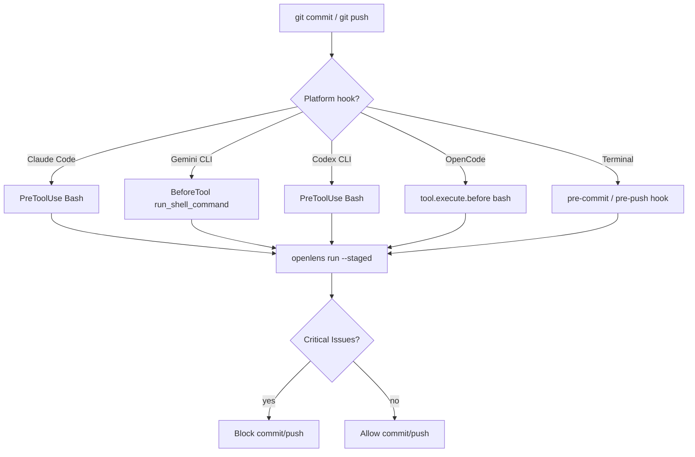

# OpenLens Hooks Guide

Automate code review on every commit and push — git hooks for the terminal, platform hooks for AI coding agents.

---

## Git Hooks (pre-commit / pre-push)

Block commits and pushes that contain critical security or bug issues.

### Install

```bash
openlens hooks install
```

This installs:
- **pre-commit** — reviews staged changes with security+bugs agents (~15s). Blocks on critical.
- **pre-push** — reviews full branch diff with all agents (~60s). Blocks on critical.

### Customize agents

```bash
OPENLENS_AGENTS=security git commit -m "feat: add auth"     # security only
OPENLENS_AGENTS=security,bugs git push                       # security+bugs only
```

### Skip once

```bash
OPENLENS_SKIP=1 git commit -m "wip"
```

### Remove

```bash
openlens hooks remove
```

### Global (all repos)

```bash
git config --global core.hooksPath ~/.config/openlens/hooks
mkdir -p ~/.config/openlens/hooks
cp /path/to/OpenLens/hooks/pre-commit ~/.config/openlens/hooks/
cp /path/to/OpenLens/hooks/pre-push ~/.config/openlens/hooks/
```

---

## Claude Code Hooks

Intercepts `git commit` and `git push` commands. When Claude runs either, OpenLens reviews first. Critical issues block the command.

### Setup

Add to `.claude/settings.json` (project) or `~/.claude/settings.json` (global):

```json
{
  "hooks": {
    "PreToolUse": [
      {
        "matcher": "Bash",
        "hooks": [
          {
            "type": "command",
            "command": "bash -c 'INPUT=$(cat); CMD=$(echo \"$INPUT\" | jq -r .tool_input.command 2>/dev/null); if echo \"$CMD\" | grep -qE \"^git (commit|push)\"; then openlens run --staged --agents security,bugs --no-verify --no-context --format text >&2; else exit 0; fi'",
            "timeout": 180,
            "statusMessage": "OpenLens reviewing before commit/push..."
          }
        ]
      }
    ]
  }
}
```

### How it works

- Matches `Bash` tool usage via `PreToolUse`
- Reads stdin JSON, extracts the command
- Only triggers when command starts with `git commit` or `git push`
- Exit code 0 = clean, commit proceeds. Exit code 1 = critical issues, blocks with exit 2
- Other commands pass through untouched

Or use the ready-made file: `cp hooks/claude-code-hooks.json .claude/settings.json`

---

## Gemini CLI Hooks

Intercepts shell commands before execution. Blocks `git commit` and `git push` on critical issues.

### Setup

Add to `.gemini/settings.json` (project) or `~/.gemini/settings.json` (global):

```json
{
  "hooksConfig": {
    "enabled": true
  },
  "hooks": {
    "BeforeTool": [
      {
        "matcher": "run_shell_command",
        "hooks": [
          {
            "type": "command",
            "command": "bash -c 'INPUT=$(cat); CMD=$(echo \"$INPUT\" | jq -r .tool_input.command 2>/dev/null); if echo \"$CMD\" | grep -qE \"^git (commit|push)\"; then openlens run --staged --agents security,bugs --no-verify --no-context --format text >&2; else exit 0; fi'",
            "name": "openlens-precommit",
            "timeout": 180000,
            "description": "Run OpenLens review before git commit/push"
          }
        ]
      }
    ]
  }
}
```

### Notes

- Gemini uses snake_case tool names (`run_shell_command`)
- Timeouts are in milliseconds (180000 = 3 minutes)
- Manage hooks: `/hooks panel`, `/hooks enable-all`, `/hooks disable <name>`

Or use the ready-made file: `cp hooks/gemini-hooks.json .gemini/settings.json`

---

## Codex CLI Hooks

Intercepts `Bash` tool before execution. Blocks `git commit` and `git push` on critical issues.

### Setup

Create `.codex/hooks.json` (project) or `~/.codex/hooks.json` (global):

```json
{
  "hooks": {
    "PreToolUse": [
      {
        "matcher": "Bash",
        "hooks": [
          {
            "type": "command",
            "command": "bash -c 'INPUT=$(cat); CMD=$(echo \"$INPUT\" | jq -r .tool_input.command 2>/dev/null); if echo \"$CMD\" | grep -qE \"^git (commit|push)\"; then openlens run --staged --agents security,bugs --no-verify --no-context --format text >&2; else exit 0; fi'",
            "timeoutSec": 180,
            "statusMessage": "OpenLens reviewing before commit/push..."
          }
        ]
      }
    ]
  }
}
```

### Notes

- Codex uses PascalCase tool names (`Bash`) — same as Claude Code
- Timeouts use `timeoutSec` (seconds)
- Config file is `hooks.json`, NOT `config.toml`

Or use the ready-made file: `mkdir -p .codex && cp hooks/codex-hooks.json .codex/hooks.json`

---

## OpenCode Hooks

OpenCode uses a TypeScript plugin API. The hook plugin intercepts `bash` tool calls containing `git commit` or `git push`.

### Setup

Copy `hooks/opencode-hooks.ts` into your plugin, or add the hook to an existing plugin:

```typescript
import { type Plugin } from "@opencode-ai/plugin"
import { execSync } from "child_process"

const AGENTS = process.env.OPENLENS_AGENTS || "security,bugs"

const plugin: Plugin = async ({ directory }) => ({
  "tool.execute.before": async (input, output) => {
    if (input.tool !== "bash") return
    const cmd = (output.args as any)?.command || ""
    if (!/^git\s+(commit|push)/.test(cmd)) return

    try {
      execSync(
        `openlens run --staged --agents ${AGENTS} --no-verify --no-context --format text`,
        { cwd: directory, encoding: "utf-8", timeout: 120_000 }
      )
    } catch (err: any) {
      if (err.status === 1) {
        throw new Error("OpenLens found critical issues.\n\n" + (err.stdout || ""))
      }
    }
  },
})

export default plugin
```

### Notes

- OpenCode tool names are lowercase: `bash`
- Block execution by throwing an Error
- `OPENLENS_AGENTS` env var customizes which agents run

---

## Hook flow



---

## Which hook to use where

| When | Platform | Hook Event | Tool Matcher |
|------|----------|-----------|--------------|
| Before git commit/push | Claude Code | PreToolUse | Bash |
| Before git commit/push | Gemini CLI | BeforeTool | run_shell_command |
| Before git commit/push | Codex CLI | PreToolUse | Bash |
| Before git commit/push | OpenCode | tool.execute.before | bash |
| Before git commit | Git (all) | pre-commit | N/A |
| Before git push | Git (all) | pre-push | N/A |
| On demand | All platforms | `/openlens` or `$openlens` | N/A |

---

## Hook files

| File | Platform | Purpose |
|------|----------|---------|
| `hooks/pre-commit` | Git | Reviews staged changes, blocks on critical |
| `hooks/pre-push` | Git | Reviews branch diff, blocks on critical |
| `hooks/claude-code-hooks.json` | Claude Code | PreToolUse on git commit/push |
| `hooks/gemini-hooks.json` | Gemini CLI | BeforeTool on git commit/push |
| `hooks/codex-hooks.json` | Codex CLI | PreToolUse on git commit/push |
| `hooks/opencode-hooks.ts` | OpenCode | tool.execute.before on git commit/push |

### Quick install

```bash
# Git hooks (all platforms)
openlens hooks install

# Claude Code
cp hooks/claude-code-hooks.json .claude/settings.json

# Gemini CLI
cp hooks/gemini-hooks.json .gemini/settings.json

# Codex CLI
mkdir -p .codex && cp hooks/codex-hooks.json .codex/hooks.json
```
