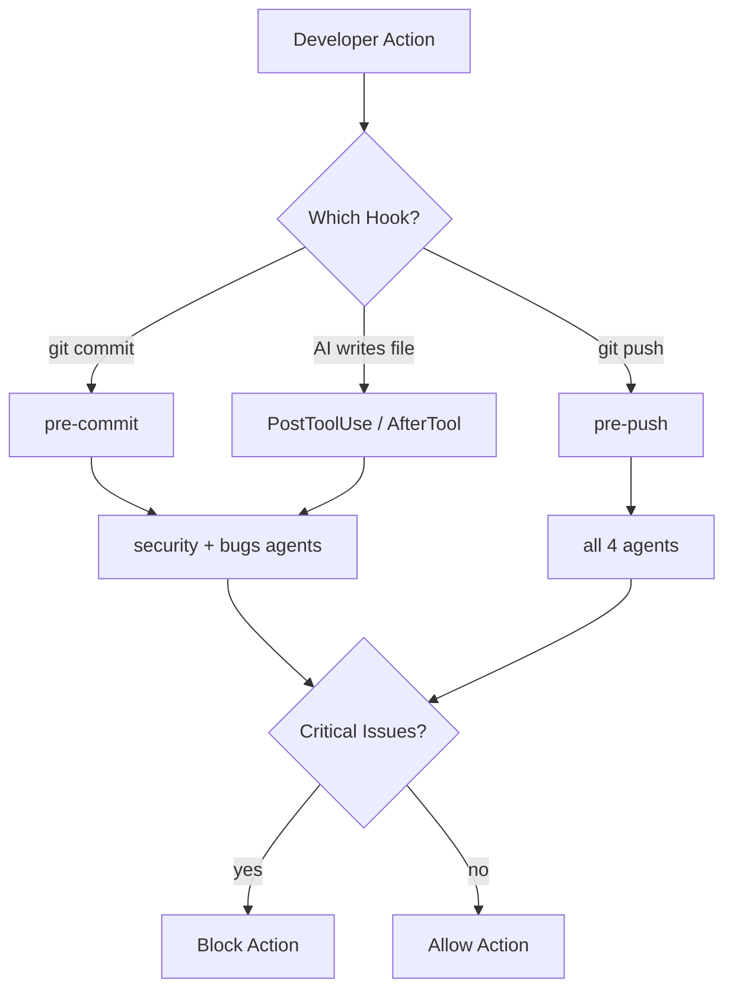

# OpenLens Hooks Guide

Automate code review at every level — git hooks block bad commits, platform hooks review as you code.

---

## Git Hooks (pre-commit / pre-push)

Block commits and pushes that contain critical security or bug issues.

### Install

```bash
openlens hooks install
```

This installs:
- **pre-commit** — reviews staged changes with security+bugs agents (~15s). Blocks on critical.
- **pre-push** — reviews full branch diff with all agents (~60s). Blocks on critical.

### Customize agents

Override which agents run via the `OPENLENS_AGENTS` env var:

```bash
# Pre-commit: only run security agent
OPENLENS_AGENTS=security git commit -m "feat: add auth"

# Pre-push: run security and bugs only (default is all agents)
OPENLENS_AGENTS=security,bugs git push
```

If `OPENLENS_AGENTS` is not set, pre-commit defaults to `security,bugs` and pre-push runs all agents.

### Skip once

```bash
OPENLENS_SKIP=1 git commit -m "wip"
OPENLENS_SKIP=1 git push
```

### Remove

```bash
openlens hooks remove
```

Restores any hooks that were backed up during install.

### Global (all repos)

```bash
git config --global core.hooksPath ~/.config/openlens/hooks
mkdir -p ~/.config/openlens/hooks
cp /path/to/OpenLens/hooks/pre-commit ~/.config/openlens/hooks/
cp /path/to/OpenLens/hooks/pre-push ~/.config/openlens/hooks/
```

---

## Claude Code Hooks

Run OpenLens automatically after Claude writes or edits files.

### Setup

Add to your project's `.claude/settings.json`:

```json
{
  "hooks": {
    "PostToolUse": [
      {
        "matcher": "Write|Edit",
        "hooks": [
          {
            "type": "command",
            "command": "openlens run --staged --agents security,bugs --no-verify --no-context --format text 2>&1 | tail -20 || true"
          }
        ]
      }
    ]
  }
}
```

### What happens

Every time Claude uses the `Write` or `Edit` tool, OpenLens runs a quick security+bugs review on staged changes. Results appear in the conversation. Non-blocking (uses `|| true`) so it doesn't interrupt Claude's flow.

### Blocking variant

To block file writes when critical issues are found, use `PreToolUse` instead:

```json
{
  "hooks": {
    "PreToolUse": [
      {
        "matcher": "Write|Edit",
        "hooks": [
          {
            "type": "command",
            "command": "openlens run --staged --agents security --no-verify --no-context --format text"
          }
        ]
      }
    ]
  }
}
```

Exit code 1 (critical issues) blocks the tool execution. Claude sees the error and adjusts.

---

## OpenCode Tools (not hooks)

OpenLens is a native OpenCode plugin. Add to your `opencode.json`:

```json
{
  "plugin": ["openlens"]
}
```

This registers 4 **tools** (`openlens`, `openlens-delegate`, `openlens-conventions`, `openlens-agents`) that OpenCode can call during sessions. This is tool registration, not hook registration -- OpenCode calls these tools on demand, not automatically before or after other actions.

> **Note:** Automatic pre-tool hooks (e.g., running a review before every file write) are not supported out of the box. To achieve this, you would need to write a custom OpenCode plugin that uses the `tool.execute.before` lifecycle event to trigger OpenLens before specific tool executions.

### Requirements

The `openlens` package must be resolvable. Either:
- `npm link` from the OpenLens repo (for development)
- `npm install -g openlens` (after publishing)
- Install in the project: `npm install openlens`

---

## Gemini CLI Hooks

Run OpenLens automatically after Gemini writes files.

### Setup

Add to your project's `.gemini/settings.json` (or `~/.gemini/settings.json` for global):

```json
{
  "hooks": {
    "AfterTool": [
      {
        "matcher": "write_file|edit_file|replace_in_file",
        "hooks": [
          {
            "type": "command",
            "command": "openlens run --staged --agents security,bugs --no-verify --no-context --format json 2>/dev/null"
          }
        ]
      }
    ]
  }
}
```

### Note

Gemini hooks communicate via stdin/stdout JSON. The command's stdout is parsed as JSON by Gemini. Use `--format json` and redirect stderr to `/dev/null`.

---

## Codex CLI Hooks

Run OpenLens after Codex executes tools.

### Setup

Add to `~/.codex/config.toml` or `.codex/config.toml`:

```toml
[[hooks]]
event = "AfterToolUse"
command = "openlens run --staged --agents security,bugs --no-verify --no-context --format text 2>&1 | tail -20 || true"
```

### Limitations

Codex hooks are experimental. There is no `BeforeToolUse` event, so you cannot block tool execution. The hook runs after changes are made.

> **Note:** The `AfterToolUse` event is experimental and may not be available in all Codex versions. Check your Codex CLI version's documentation to confirm hook support.

---

## Hook flow



---

## Which hook to use where

| When | What | Platform |
|------|------|----------|
| Before committing | Git pre-commit hook | All (git-level) |
| Before pushing | Git pre-push hook | All (git-level) |
| After AI writes a file | PostToolUse / AfterTool hook | Claude Code, Gemini, Codex |
| Before AI writes a file | PreToolUse / BeforeTool hook | Claude Code, Gemini, OpenCode (requires custom plugin) |
| On demand | `/openlens` or `$openlens` command | All platforms |
| In CI/CD | GitHub Action / GitLab CI | CI pipelines |

---

## Hook files included

All hook configs are in the `hooks/` directory:

| File | Purpose |
|------|---------|
| `hooks/pre-commit` | Git pre-commit hook (security+bugs, fast) |
| `hooks/pre-push` | Git pre-push hook (all agents, thorough) |
| `hooks/claude-code-hooks.json` | Claude Code PostToolUse config |
| `hooks/gemini-hooks.json` | Gemini CLI AfterTool config |
| `hooks/codex-hooks.toml` | Codex CLI AfterToolUse config |
