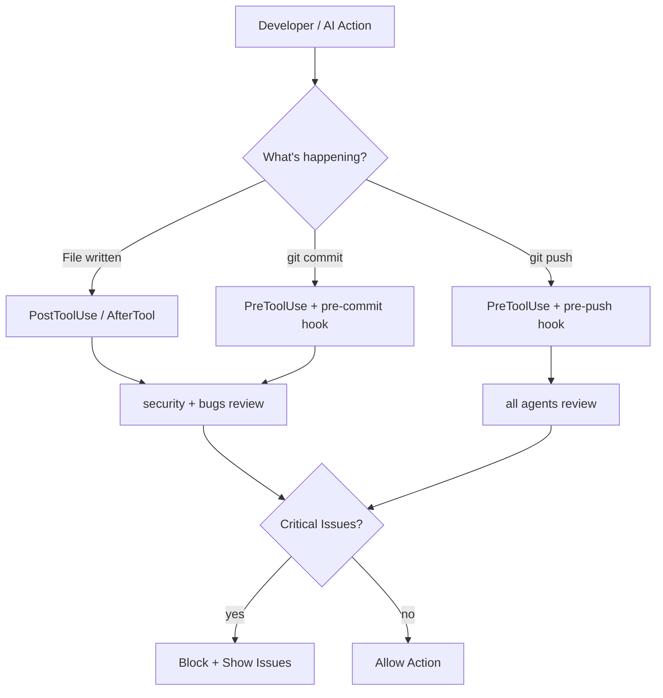

# OpenLens Hooks Guide

Automate code review at every level — git hooks block bad commits, platform hooks review as you code and catch issues before git commit/push.

---

## Git Hooks (pre-commit / pre-push)

Block commits and pushes that contain critical security or bug issues.

### Install

```bash
openlens hooks install
```

This installs:
- **pre-commit** — reviews staged changes with security+bugs agents (~15s). Blocks on critical.
- **pre-push** — reviews full branch diff with all agents (~60s). Blocks on critical.

### Customize agents

Override which agents run via the `OPENLENS_AGENTS` env var:

```bash
OPENLENS_AGENTS=security git commit -m "feat: add auth"     # security only
OPENLENS_AGENTS=security,bugs git push                       # security+bugs only
```

If `OPENLENS_AGENTS` is not set, pre-commit defaults to `security,bugs` and pre-push runs all agents.

### Skip once

```bash
OPENLENS_SKIP=1 git commit -m "wip"
OPENLENS_SKIP=1 git push
```

### Remove

```bash
openlens hooks remove
```

### Global (all repos)

```bash
git config --global core.hooksPath ~/.config/openlens/hooks
mkdir -p ~/.config/openlens/hooks
cp /path/to/OpenLens/hooks/pre-commit ~/.config/openlens/hooks/
cp /path/to/OpenLens/hooks/pre-push ~/.config/openlens/hooks/
```

---

## Claude Code Hooks

Two hooks: review after file writes, and block git commit/push on critical issues.

### Setup

Copy into your project's `.claude/settings.json` or merge with existing hooks:

```json
{
  "hooks": {
    "PostToolUse": [
      {
        "matcher": "Write|Edit",
        "hooks": [
          {
            "type": "command",
            "command": "openlens run --staged --agents security,bugs --no-verify --no-context --format text 2>&1 | tail -30 || true",
            "timeout": 120,
            "statusMessage": "Running OpenLens review..."
          }
        ]
      }
    ],
    "PreToolUse": [
      {
        "matcher": "Bash",
        "hooks": [
          {
            "type": "command",
            "command": "bash -c 'INPUT=$(cat); CMD=$(echo \"$INPUT\" | jq -r .tool_input.command 2>/dev/null); if echo \"$CMD\" | grep -qE \"^git (commit|push)\"; then openlens run --staged --agents security,bugs --no-verify --no-context --format text >&2; else exit 0; fi'",
            "timeout": 180,
            "statusMessage": "OpenLens pre-commit review..."
          }
        ]
      }
    ]
  }
}
```

### What happens

- **PostToolUse (Write|Edit):** After Claude writes or edits a file, OpenLens runs a quick review. Non-blocking (`|| true`) — results appear as context but don't stop Claude.
- **PreToolUse (Bash → git commit/push):** When Claude runs `git commit` or `git push`, OpenLens reviews first. Exit code 1 (critical issues) = exit code 2 → blocks the command. Claude sees the issues and fixes them before retrying.

### Config location

- `.claude/settings.json` — project-scoped (committable to repo)
- `~/.claude/settings.json` — user-scoped (global)

Or use the ready-made file: `cp hooks/claude-code-hooks.json .claude/settings.json`

---

## Gemini CLI Hooks

Two hooks: review after file writes, and review before git commit/push via shell commands.

### Setup

Add to `.gemini/settings.json` (project) or `~/.gemini/settings.json` (global):

```json
{
  "hooksConfig": {
    "enabled": true
  },
  "hooks": {
    "AfterTool": [
      {
        "matcher": "write_file|edit_file|create_file",
        "hooks": [
          {
            "type": "command",
            "command": "openlens run --staged --agents security,bugs --no-verify --no-context --format text >&2 || true",
            "name": "openlens-review",
            "timeout": 120000,
            "description": "Run OpenLens review after file edits"
          }
        ]
      }
    ],
    "BeforeTool": [
      {
        "matcher": "run_shell_command",
        "hooks": [
          {
            "type": "command",
            "command": "bash -c 'INPUT=$(cat); CMD=$(echo \"$INPUT\" | jq -r .tool_input.command 2>/dev/null); if echo \"$CMD\" | grep -qE \"^git (commit|push)\"; then openlens run --staged --agents security,bugs --no-verify --no-context --format text >&2; else exit 0; fi'",
            "name": "openlens-precommit",
            "timeout": 180000,
            "description": "Run OpenLens review before git commit/push"
          }
        ]
      }
    ]
  }
}
```

### What happens

- **AfterTool (write_file|edit_file):** Reviews after Gemini writes files. Output goes to stderr (Gemini expects JSON on stdout). Non-blocking.
- **BeforeTool (run_shell_command → git commit/push):** Reviews before git operations. Exit code 1 blocks the command.

### Notes

- Gemini uses snake_case tool names (`write_file`, `edit_file`, `run_shell_command`)
- Timeouts are in milliseconds (120000 = 2 minutes)
- Manage hooks: `/hooks panel`, `/hooks enable-all`, `/hooks disable <name>`

Or use the ready-made file: `cp hooks/gemini-hooks.json .gemini/settings.json`

---

## Codex CLI Hooks

Two hooks: review after file writes, and review before git commit/push.

### Setup

Create `.codex/hooks.json` (project) or `~/.codex/hooks.json` (global):

```json
{
  "hooks": {
    "PostToolUse": [
      {
        "matcher": "Write|Edit",
        "hooks": [
          {
            "type": "command",
            "command": "openlens run --staged --agents security,bugs --no-verify --no-context --format text 2>&1 | tail -30 || true",
            "timeoutSec": 120,
            "statusMessage": "Running OpenLens review..."
          }
        ]
      }
    ],
    "PreToolUse": [
      {
        "matcher": "Bash",
        "hooks": [
          {
            "type": "command",
            "command": "bash -c 'INPUT=$(cat); CMD=$(echo \"$INPUT\" | jq -r .tool_input.command 2>/dev/null); if echo \"$CMD\" | grep -qE \"^git (commit|push)\"; then openlens run --staged --agents security,bugs --no-verify --no-context --format text >&2; else exit 0; fi'",
            "timeoutSec": 180,
            "statusMessage": "OpenLens pre-commit review..."
          }
        ]
      }
    ]
  }
}
```

### What happens

- **PostToolUse (Write|Edit):** Reviews after Codex writes files. Non-blocking.
- **PreToolUse (Bash → git commit/push):** Reviews before git operations. Exit code 2 blocks the command.

### Notes

- Codex uses PascalCase tool names (`Write`, `Edit`, `Bash`) — same as Claude Code
- Timeouts use `timeoutSec` (in seconds)
- Config file is `hooks.json`, NOT `config.toml`

Or use the ready-made file: `cp hooks/codex-hooks.json .codex/hooks.json`

---

## OpenCode Hooks

OpenCode uses a programmatic TypeScript plugin API. A hook plugin is included at `hooks/opencode-hooks.ts`.

### What it does

- **tool.execute.after (write|edit|patch):** Appends OpenLens review findings to the tool output so OpenCode sees the issues.
- **tool.execute.before (bash → git commit/push):** Blocks the command if critical issues are found by throwing an error.

### Setup

The base OpenLens plugin (`"plugin": ["openlens"]`) registers tools. To add hooks, you need to extend it with the hook plugin or copy the hook logic into your own plugin.

```typescript
// hooks/opencode-hooks.ts — copy into your plugin or import
import { type Plugin } from "@opencode-ai/plugin"
import { execSync } from "child_process"

const WRITE_TOOLS = new Set(["write", "edit", "patch"])
const AGENTS = process.env.OPENLENS_AGENTS || "security,bugs"

const plugin: Plugin = async ({ directory }) => ({
  "tool.execute.after": async (input, output) => {
    if (!WRITE_TOOLS.has(input.tool)) return
    try {
      const result = execSync(
        `openlens run --staged --agents ${AGENTS} --no-verify --no-context --format text`,
        { cwd: directory, encoding: "utf-8", timeout: 120_000 }
      )
      if (result.trim()) {
        output.output += "\n\n--- OpenLens Review ---\n" + result
      }
    } catch {}
  },

  "tool.execute.before": async (input, output) => {
    if (input.tool !== "bash") return
    const cmd = (output.args as any)?.command || ""
    if (!/^git\s+(commit|push)/.test(cmd)) return
    try {
      execSync(
        `openlens run --staged --agents ${AGENTS} --no-verify --no-context --format text`,
        { cwd: directory, encoding: "utf-8", timeout: 120_000 }
      )
    } catch (err: any) {
      if (err.status === 1) {
        throw new Error("OpenLens found critical issues.\n\n" + (err.stdout || ""))
      }
    }
  },
})

export default plugin
```

### Notes

- OpenCode tool names are lowercase: `write`, `edit`, `bash`, `patch`
- Block execution by throwing an Error in `tool.execute.before`
- `OPENLENS_AGENTS` env var customizes which agents run

---

## Hook flow



---

## Which hook to use where

| When | What | Claude Code | Gemini CLI | Codex CLI | OpenCode |
|------|------|------------|------------|-----------|----------|
| After file write | Review changes | PostToolUse | AfterTool | PostToolUse | tool.execute.after |
| Before git commit/push | Block on critical | PreToolUse (Bash) | BeforeTool (run_shell_command) | PreToolUse (Bash) | tool.execute.before |
| Before any commit | Git hook | pre-commit | pre-commit | pre-commit | pre-commit |
| Before any push | Git hook | pre-push | pre-push | pre-push | pre-push |
| On demand | Manual | `/openlens` | `/openlens` | `$openlens` | `/openlens` tool |

---

## Hook files included

| File | Platform | Format | Purpose |
|------|----------|--------|---------|
| `hooks/pre-commit` | Git (all) | Bash | Pre-commit hook |
| `hooks/pre-push` | Git (all) | Bash | Pre-push hook |
| `hooks/claude-code-hooks.json` | Claude Code | JSON | PostToolUse + PreToolUse (git) |
| `hooks/gemini-hooks.json` | Gemini CLI | JSON | AfterTool + BeforeTool (git) |
| `hooks/codex-hooks.json` | Codex CLI | JSON | PostToolUse + PreToolUse (git) |
| `hooks/opencode-hooks.ts` | OpenCode | TypeScript | tool.execute.after + before |

### Quick install

```bash
# Git hooks
openlens hooks install

# Claude Code
cp hooks/claude-code-hooks.json .claude/settings.json

# Gemini CLI
cp hooks/gemini-hooks.json .gemini/settings.json

# Codex CLI
mkdir -p .codex && cp hooks/codex-hooks.json .codex/hooks.json
```
