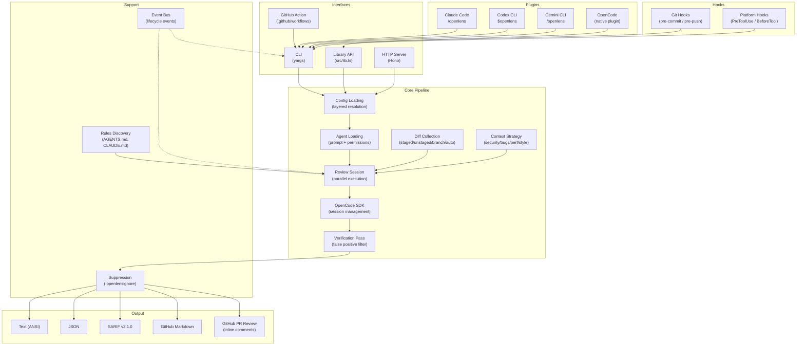

# openlens Overview

openlens is an AI-powered code review tool that runs multiple specialized agents in parallel to analyze code changes for security vulnerabilities, bugs, performance issues, and style problems. It provides five interfaces: a **CLI** built on yargs, a **programmatic library** API, an **HTTP server** built on Hono, a **GitHub Action** with inline PR comments, and **platform plugins** for Claude Code, Codex, Gemini CLI, and OpenCode. Git hooks and platform hooks automate reviews on every commit and push.

By default, openlens uses the `opencode/big-pickle` model via the OpenCode SDK, requiring no API keys. Agents operate in read-only mode and communicate results as structured JSON with confidence scoring, severity levels, and optional fix suggestions.

## Architecture Diagram



## What openlens Does

openlens accepts a git diff (staged, unstaged, or branch-level) and fans it out to multiple AI review agents. Each agent specializes in a different concern -- security, bugs, performance, or style -- and returns structured issues with file locations, severity, confidence, and suggested fixes. Results are deduplicated, filtered by confidence threshold, optionally verified by a cross-checking pass, and formatted for the target output.

The four built-in agents are defined as markdown prompt files in `agents/` and loaded via `{file:agents/<name>.md}` references in config ([src/config/config.ts](../src/config/config.ts), lines 8-25).

### Interfaces

| Interface | Entry Point | Description |
|-----------|------------|-------------|
| **CLI** | `src/index.ts` | yargs-based commands: `run`, `agent`, `hooks`, `docs`, `init`, `doctor`, `serve`, `models` |
| **Library** | `src/lib.ts` | Programmatic API exporting `runReview`, `loadConfig`, `formatText`, etc. |
| **HTTP Server** | `src/server/server.ts` | Hono-based REST API for remote/CI integration |
| **Plugins** | `plugins/` | Thin adapters that shell out to `openlens run --format json` |

### Platform Plugins

| Plugin | Location | Integration |
|--------|----------|-------------|
| Claude Code | `plugins/claude-code/SKILL.md` | `/openlens` slash command |
| Codex | `plugins/codex/SKILL.md` | `$openlens` skill |
| Gemini | `plugins/gemini/openlens.toml` | `/openlens` custom command |
| OpenCode | `src/plugin.ts` | Native plugin (4 tools) |

## Repository Layout

```
openlens/
  agents/
    bugs.md                    # Built-in bug detection prompt
    performance.md             # Built-in performance review prompt
    security.md                # Built-in security scanner prompt
    style.md                   # Built-in style checker prompt
  src/
    index.ts                   # CLI entry point (yargs commands)
    lib.ts                     # Public library API exports
    plugin.ts                  # OpenCode plugin registration
    agent/
      agent.ts                 # Agent loading, prompt resolution, permission merging
    bus/
      index.ts                 # Typed event bus (publish/subscribe)
    config/
      config.ts                # Layered config loading + rules/instructions
      rules.ts                 # Rules file discovery (AGENTS.md, CLAUDE.md, etc.)
      schema.ts                # Zod schemas for Config and AgentConfig
    context/
      strategy.ts              # Auto-gather relevant files per agent strategy
    output/
      format.ts                # Text, JSON, SARIF, Markdown formatters
      github-review.ts         # GitHub PR review with inline comments
    server/
      server.ts                # Hono HTTP server
    session/
      review.ts                # Review orchestration (parallel agents, verification)
    tool/
      diff.ts                  # Git diff collection (staged/unstaged/branch/auto)
    docs/
      serve.ts                 # Local wiki server (dark theme, mermaid, search)
    env.ts                     # CI detection + base branch inference
    suppress.ts                # File-glob and text-pattern suppression
    types.ts                   # Issue and ReviewResult Zod schemas
  plugins/
    claude-code/
      SKILL.md                 # Claude Code /openlens slash command
    codex/
      SKILL.md                 # Codex CLI plugin manifest
    gemini/
      openlens.toml            # Gemini CLI tool registration
  hooks/
    pre-commit                   # Git hook: security+bugs on staged changes (~15s)
    pre-push                     # Git hook: all agents on branch diff (~60s)
    claude-code-hooks.json       # Platform hook for Claude Code (git commit/push)
    gemini-hooks.json            # Platform hook for Gemini CLI (git commit/push)
    codex-hooks.json             # Platform hook for Codex CLI (git commit/push)
    opencode-hooks.ts            # Platform hook for OpenCode (git commit/push)
  test/
    unit/                      # Unit tests (config, agents, diff, formatting, suppression)
    integration/               # Full review workflow tests
    e2e/                       # CLI subprocess tests with temp git repos
  .github/
    workflows/
      ci.yml                   # CI: typecheck -> unit tests -> CLI smoke tests
```

## Key Features

| Feature | Description | Source |
|---------|-------------|--------|
| Multi-agent parallel review | Up to 4 agents run concurrently (configurable via `maxConcurrency`) | `src/session/review.ts` line 919 |
| Layered configuration | Defaults, global, project, env vars, CLI flags merged in order | `src/config/config.ts` lines 90-139 |
| Confidence scoring | Issues carry `high`/`medium`/`low` confidence; threshold filtering | `src/session/review.ts` lines 574-582 |
| Verification pass | Optional cross-agent verification to filter false positives | `src/session/review.ts` lines 469-557 |
| SARIF output | Standard static analysis format for CI/CD integration | `src/output/format.ts` lines 137-210 |
| GitHub PR reviews | Inline comments on specific diff lines with fingerprinted issues | `src/output/github-review.ts` |
| Read-only agents | Default permissions deny edit/write/bash; allow read/grep/glob | `src/agent/agent.ts` lines 66-80 |
| CI auto-detection | Detects GitHub Actions, GitLab CI, CircleCI, Buildkite, Jenkins, Travis | `src/env.ts` |
| Suppression rules | File-glob and text-pattern matching via config or `.openlensignore` | `src/suppress.ts` |
| Context strategies | Per-agent auto-gathering of related files (security, bugs, perf, style) | `src/context/strategy.ts` |
| MCP server support | Connect external tool servers via Model Context Protocol | `src/session/review.ts` lines 599-635 |
| Event bus | Typed publish/subscribe for lifecycle events | `src/bus/index.ts` lines 7-45 |
| Git hooks | Automatic pre-commit and pre-push review with `openlens hooks install` | `hooks/pre-commit`, `hooks/pre-push` |
| Local docs server | `openlens docs` serves wiki locally with dark theme + mermaid diagrams | `src/index.ts` |
| No API keys required | Default model `opencode/big-pickle` is free to use | `src/config/schema.ts` line 43 |

## Related Wiki Pages

- [Core Architecture](./2-core-architecture.md) — Config loading, agent resolution, review orchestration
- [Agent System](./3-agent-system.md) — Agent format, permissions, context strategies, confidence
- [Configuration](./4-configuration.md) — Config files, schemas, suppression, CI detection
- [Review Pipeline](./5-review-pipeline.md) — SSE streaming, server lifecycle, verification
- [CLI Reference](./6-cli-reference.md) — All commands and flags
- [Output Formats](./7-output-formats.md) — Text, JSON, SARIF, Markdown, GitHub Review
- [Integrations](./8-integrations.md) — GitHub Actions, plugins, hooks, HTTP server, library
- [Testing](./9-testing.md) — Test runner, tiers, CI workflow
- [Glossary](./10-glossary.md) — Key terms

## Relevant source files

- [src/index.ts](../src/index.ts) - CLI entry point (yargs command definitions)
- [src/lib.ts](../src/lib.ts) - Public library API exports
- [src/server/server.ts](../src/server/server.ts) - HTTP server (Hono)
- [src/plugin.ts](../src/plugin.ts) - OpenCode plugin registration
- [src/config/schema.ts](../src/config/schema.ts) - Zod schema definitions for all config and data shapes
- [src/types.ts](../src/types.ts) - Issue and ReviewResult schemas
