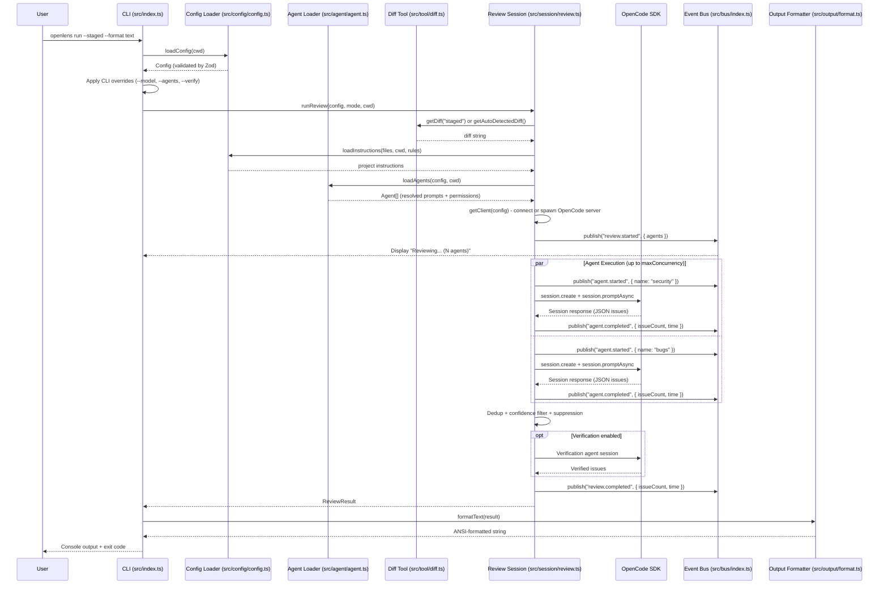
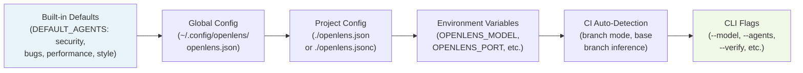
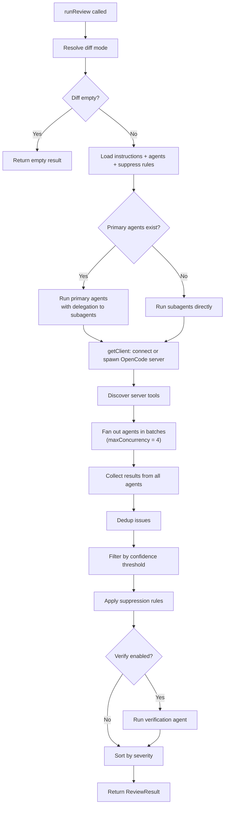

# Core Architecture

## Relevant source files

- [src/config/config.ts](../src/config/config.ts) - Layered config loading (lines 90-139)
- [src/config/schema.ts](../src/config/schema.ts) - Zod schemas for Config and AgentConfig
- [src/agent/agent.ts](../src/agent/agent.ts) - Agent loading, prompt resolution, permission merging
- [src/tool/diff.ts](../src/tool/diff.ts) - Git diff collection
- [src/session/review.ts](../src/session/review.ts) - Review orchestration and verification
- [src/output/format.ts](../src/output/format.ts) - Text, JSON, SARIF, Markdown formatters
- [src/bus/index.ts](../src/bus/index.ts) - Typed event bus
- [src/index.ts](../src/index.ts) - CLI entry point
- [src/types.ts](../src/types.ts) - Issue and ReviewResult schemas

This page covers the core review pipeline in detail, from CLI invocation through config loading, agent resolution, diff collection, parallel review execution, and output formatting.

## Full Review Flow

The following sequence diagram traces a complete review from CLI invocation to formatted output.



## 1. Config Loading

Configuration follows a strict layering order where each subsequent layer overrides the previous. The `loadConfig` function in `src/config/config.ts` (lines 90-139) implements this.

### Config Layering Diagram



### Layer Details

**Layer 0 -- Built-in defaults** (lines 8-25): Four default agents are hardcoded with `{file:agents/<name>.md}` prompt references:

```
security, bugs, performance, style
```

**Layer 1 -- Global config** (lines 96-100): Reads `~/.config/openlens/openlens.json` via `readJsonc()`, which strips JSON comments before parsing.

**Layer 2 -- Project config** (lines 103-109): Searches for `openlens.json` or `openlens.jsonc` in the working directory. First match wins.

**Layer 3 -- Environment variables** (lines 112-118): Direct overrides for `OPENLENS_MODEL` and `OPENLENS_PORT`. Additionally, any string value in config can reference environment variables via `{env:VAR_NAME}` syntax, resolved by `resolveStringValues()` (line 136).

**Layer 4 -- CI detection** (lines 121-133): When a CI environment is detected (`detectCI()` from `src/env.ts`), defaults change to `branch` mode and the base branch is inferred from CI-specific environment variables.

**Layer 5 -- CLI flags** (applied in `src/index.ts`, lines 114-128): Flags like `--model`, `--agents`, `--verify`, and `--context` override the merged config directly before the review runs.

All layers merge via `deepMerge()` (lines 58-75), then the result is validated through `ConfigSchema.parse()` (line 139). The Zod schema is defined in `src/config/schema.ts` and provides defaults for all fields:

| Config Field | Default | Schema Location |
|---|---|---|
| `model` | `"opencode/big-pickle"` | `schema.ts` line 43 |
| `review.defaultMode` | `"staged"` | `schema.ts` line 56 |
| `review.maxConcurrency` | `4` | `schema.ts` line 63 |
| `review.timeoutMs` | `180000` (3 min) | `schema.ts` line 62 |
| `review.verify` | `true` | `schema.ts` line 61 |
| `review.fullFileContext` | `true` | `schema.ts` line 60 |
| `review.minConfidence` | `"medium"` | `schema.ts` line 64 |
| `server.port` | `4096` | `schema.ts` line 49 |

## 2. Agent Loading and Resolution

Agent loading is handled by `loadAgents()` in `src/agent/agent.ts` (lines 82-125). Each agent goes through prompt resolution and permission merging.

### Prompt Resolution

The `resolvePrompt()` function (lines 28-62) follows a three-step fallback:

1. **File reference**: If the prompt matches `{file:<path>}`, the file is read and parsed for YAML frontmatter via `gray-matter`. This is the default for built-in agents (e.g., `{file:agents/security.md}`).
2. **Inline string**: If the prompt does not start with `{`, it is used as-is with no frontmatter.
3. **Built-in fallback**: If no prompt is provided or the file reference fails, the system looks for `agents/<agentName>.md` in the package directory. If that also fails, a minimal fallback prompt is generated (lines 57-59).

### Permission Merging

Permissions merge in four layers (lines 98-104):

```
DEFAULT_PERMISSIONS < global config.permission < frontmatter.permission < agent config.permission
```

The default permission set (`DEFAULT_PERMISSIONS`, lines 66-80) is read-only:

| Tool | Default |
|------|---------|
| `read`, `grep`, `glob`, `list`, `lsp`, `skill` | `allow` |
| `edit`, `write`, `patch`, `bash`, `webfetch`, `websearch`, `task` | `deny` |

### Agent Properties

Each resolved agent carries these fields (interface at lines 7-23):

| Field | Source Priority | Default |
|---|---|---|
| `name` | Config key | -- |
| `mode` | agent config > frontmatter | `"subagent"` |
| `model` | agent config > frontmatter > global `config.model` | `"opencode/big-pickle"` |
| `prompt` | Resolved from file/inline/builtin | Generated fallback |
| `steps` | agent config > frontmatter | `5` |
| `context` | agent config > frontmatter | `undefined` |
| `permission` | Merged 4-layer map | Read-only defaults |

## 3. Diff Collection

The diff module (`src/tool/diff.ts`) provides three functions for collecting git diffs.

### getDiff() (lines 3-18)

Accepts a mode and optional base branch. Maps directly to git commands:

| Mode | Git Command |
|------|------------|
| `staged` | `git diff --cached` |
| `unstaged` | `git diff` |
| `branch` | `git diff <baseBranch>...HEAD` |

Uses `spawnSync` with a 50 MB buffer limit (line 13).

### getAutoDetectedDiff() (lines 20-31)

Implements the `auto` mode by trying each diff type in order: staged, then unstaged, then branch. Returns the first non-empty result along with the detected mode.

### getDiffStats() (lines 33-60)

Parses a raw diff string to extract file names, insertion count, and deletion count. Used to populate `meta.filesChanged` in review results and to determine which files to read for full file context.

## 4. Review Orchestration

The `runReview()` function in `src/session/review.ts` (lines 828-1039) coordinates the entire review pipeline.

### Execution Flow



### Parallel Execution

Agents execute in batches controlled by `config.review.maxConcurrency` (default 4). The batching logic at lines 924-967:

```typescript
for (let i = 0; i < agents.length; i += concurrency) {
  const batch = agents.slice(i, i + concurrency)
  const batchResults = await Promise.allSettled(batch.map(...))
  results.push(...batchResults)
}
```

Each agent runs in its own OpenCode SDK session. The `runSingleAgent()` function (lines 378-467):
1. Creates a new session via `client.session.create()`
2. Builds a user message containing instructions, diff, file context, and tool list
3. Sends the prompt via `client.session.promptAsync()`
4. Waits for session completion via SSE streaming (preferred) or status polling (fallback)
5. Extracts the assistant response and parses the JSON issue array
6. Validates issues against `IssueArraySchema` from `src/types.ts`
7. Cleans up the session in a `finally` block

### Agent Modes

Agents have three modes (`src/config/schema.ts` line 21):

| Mode | Behavior |
|------|----------|
| `primary` | Orchestrator agent that can delegate to subagents via `openlens-delegate` tool |
| `subagent` | Standard agent that runs independently in parallel |
| `all` | Treated as a subagent for direct execution, also available for delegation |

When primary agents exist, only they run directly. They receive the subagent list and can delegate focused review tasks (lines 877-883).

### OpenCode Server Management

The `getClient()` function (lines 721-757) first tries to connect to an existing OpenCode server at the configured address. If none is running, it spawns one via `spawnOpencodeServer()` (lines 638-718), which:
- Resolves the `opencode` binary path
- Starts it with `serve --hostname=<host> --port=<port>`
- Waits for the "listening" message on stdout (5s timeout, 15s in CI)
- Returns a cleanup function to kill the process

### Verification Pass

When `config.review.verify` is `true` (default), the `verifyIssues()` function (lines 469-557) runs after all agents complete. It creates a dedicated verification session that:

1. Receives all issues grouped by the agent that found them
2. Applies decision rules: boost confidence when multiple agents agree, remove low-confidence single-agent findings
3. Uses read-only tools (`read`, `grep`, `glob`, `list`) to investigate
4. Returns only confirmed issues with potentially adjusted confidence levels
5. Falls back to unfiltered issues on failure (line 549)

### Post-Processing Pipeline

After agent execution, issues go through three filters in order:

1. **Deduplication** (`dedup()`, lines 559-572): Issues with the same `file:line:endLine:title` key are merged, keeping the highest severity.
2. **Confidence filtering** (`filterByConfidence()`, lines 576-582): Issues below `minConfidence` threshold are removed. Rank: `high=0`, `medium=1`, `low=2`.
3. **Suppression** (lines 990-997): Issues matching file-glob or text patterns from config or `.openlensignore` are removed.

## 5. Event Bus

The event bus in `src/bus/index.ts` provides typed publish/subscribe for review lifecycle events. It is created by the generic `createBus<TEvents>()` factory (lines 7-45).

### Event Types

Defined as `ReviewEvents` (lines 48-63):

| Event | Payload | When |
|-------|---------|------|
| `review.started` | `{ agents: string[] }` | Before agent execution begins |
| `agent.started` | `{ name: string }` | When an agent's session is created |
| `agent.progress` | `{ name, kind, detail }` | During SSE streaming (tool calls, steps) |
| `agent.completed` | `{ name, issueCount, time }` | When an agent finishes successfully |
| `agent.failed` | `{ name, error }` | When an agent throws an error |
| `review.completed` | `{ issueCount, time }` | After all post-processing completes |

The bus is a singleton exported as `bus` (line 65). The CLI subscribes to events for live progress display (`src/index.ts`, lines 209-229), and programmatic consumers can subscribe via the library API.

Error isolation: subscriber exceptions are caught silently (line 25) to prevent one handler from crashing the publisher.

## 6. Output Formatting

The output module (`src/output/format.ts`) provides four formatters, each taking a `ReviewResult` and returning a string.

### Formatter Summary

| Format | Function | Lines | Use Case |
|--------|----------|-------|----------|
| Text (ANSI) | `formatText()` | 71-130 | Terminal display with color-coded severity |
| JSON | `formatJson()` | 132-134 | Machine-readable output, plugin integration |
| SARIF v2.1.0 | `formatSarif()` | 137-210 | CI/CD integration (GitHub Code Scanning, etc.) |
| Markdown | `formatMarkdown()` | 278-387 | GitHub PR comments with collapsible file sections |

### Text Format

Color-codes issues by severity (`CRITICAL` in red, `WARNING` in yellow, `INFO` in blue). Shows file:line location, agent name, confidence level, fix suggestions, and optional patches with diff coloring. Respects `NO_COLOR` environment variable (line 3).

### SARIF Format

Generates a valid SARIF v2.1.0 document with:
- Tool driver metadata including version `0.2.0` and repository URI (lines 145-155)
- Rule definitions derived from agent names (line 149)
- Severity mapping: `critical` to `error`, `warning` to `warning`, `info` to `note` (lines 159-163)
- Confidence mapped to SARIF `rank`: high=90.0, medium=50.0, low=10.0 (line 179)
- Optional `fixes` array when a patch is present (lines 181-203)

### Markdown Format

Generates GitHub-flavored markdown with:
- An `<!-- openlens-review -->` marker for comment upsert detection (line 287)
- Severity summary table with emoji indicators (lines 320-326)
- Issues grouped by file in collapsible `<details>` blocks (lines 344-360)
- File links to GitHub when `repo` and `sha` options are provided (lines 232-244)
- Truncation at 60,000 characters for GitHub comment limits (lines 379-384)

### GitHub PR Review

A separate module `src/output/github-review.ts` formats results as GitHub PR review payloads with inline comments positioned on specific diff lines. Issues are fingerprinted using SHA-256 of `file+title+agent` (excluding line numbers) for incremental updates -- resolved issues get marked on re-runs.

## Related Wiki Pages

- [Overview](./1-overview.md) - High-level architecture, repository layout, and feature summary
