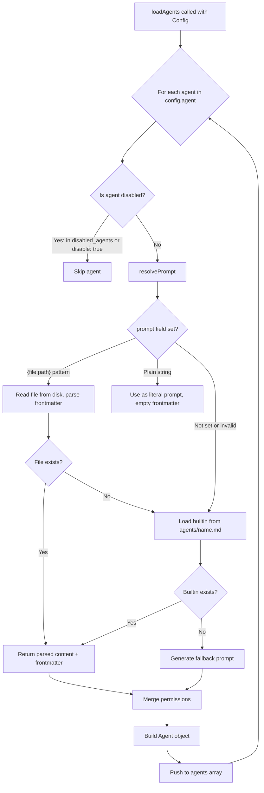
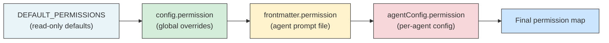

# Agent System

The agent system is the core abstraction that drives OpenLens code reviews. Each agent is a specialized AI reviewer with its own prompt, permissions, context strategy, and confidence thresholds. Agents run in parallel against the same diff and produce structured issue arrays that are later deduplicated, filtered, and optionally verified.

## Agent File Format

Agent prompts are Markdown files with YAML frontmatter. The frontmatter declares metadata and defaults that can be overridden by config. The Markdown body is the system prompt sent to the LLM.

```markdown
---
description: Security vulnerability scanner
context: security
mode: subagent
model: opencode/big-pickle
steps: 5
permission:
  read: allow
  grep: allow
  glob: allow
  list: allow
  edit: deny
  write: deny
  bash: deny
---

You are a security-focused code reviewer with access to the full codebase.

## How to review
...
```

The frontmatter is parsed by `gray-matter` in `resolvePrompt()` ([src/agent/agent.ts:39](../src/agent/agent.ts)). Any field declared in frontmatter can also be set in the `agent` section of `openlens.json`, with config values taking precedence over frontmatter values.

## Agent Resolution Flow

When `loadAgents()` is called, it iterates over every agent entry in `config.agent`, skips disabled agents, resolves the prompt, and merges permissions through the inheritance chain.



The prompt resolution in `resolvePrompt()` follows a three-tier fallback ([src/agent/agent.ts:28-62](../src/agent/agent.ts)):

1. **`{file:path}` reference** -- If the `prompt` field matches the pattern `{file:...}`, the file is read from disk relative to `cwd` and parsed with `gray-matter` for frontmatter extraction.
2. **Inline string** -- If the `prompt` field is a plain string (not starting with `{`), it is used directly as the prompt with no frontmatter.
3. **Built-in agent** -- If no prompt is configured or the file reference fails, the system looks for `agents/<agentName>.md` in the package's built-in prompts directory.
4. **Fallback** -- If the built-in file also doesn't exist, a minimal generic prompt is generated: `"You are a <name> code reviewer..."`.

## Built-in Agents

OpenLens ships with four specialized agents, each configured as a default in `loadConfig()` ([src/config/config.ts:8-25](../src/config/config.ts)):

| Agent | Description | Context Strategy | Focus Areas |
|-------|-------------|-----------------|-------------|
| **security** | Security vulnerability scanner | `security` | SQL/NoSQL injection, XSS, auth flaws, hardcoded secrets, path traversal, insecure deserialization, SSRF, unsafe eval/exec, insecure crypto |
| **bugs** | Bug and logic error detector | `bugs` | Null/undefined dereferences, off-by-one errors, race conditions, missing error handling, missing `await`, incorrect comparisons, resource leaks, type coercion bugs |
| **performance** | Performance issue finder | `performance` | N+1 queries, unnecessary allocations in hot paths, missing caching, O(n^2) algorithms, sync blocking in async contexts, missing pagination, redundant API calls |
| **style** | Style and convention checker | `style` | Naming convention violations, dead code, inconsistency with surrounding code, excessive `any` types, functions doing too many things, project convention violations |

Each agent explicitly defines what it should **not** flag to avoid overlap. For example, the bugs agent states: *"Security vulnerabilities (SQL injection, XSS, hardcoded secrets, path traversal, auth flaws) -- the security agent handles these"* ([agents/bugs.md:49](../agents/bugs.md)).

## Permission System

Agents operate under a granular permission model that controls which OpenCode tools they can use. Each tool can be set to `"allow"`, `"deny"`, or `"ask"`. Permissions can also use granular patterns via a record of pattern-to-permission mappings.

### Default Permissions

All agents start with read-only codebase access ([src/agent/agent.ts:66-80](../src/agent/agent.ts)):

| Tool | Default | Purpose |
|------|---------|---------|
| `read` | allow | Read file contents |
| `grep` | allow | Search file contents |
| `glob` | allow | Find files by pattern |
| `list` | allow | List directory contents |
| `lsp` | allow | Language server queries |
| `skill` | allow | Invoke skills |
| `edit` | **deny** | Edit files |
| `write` | **deny** | Write files |
| `patch` | **deny** | Apply patches |
| `bash` | **deny** | Execute shell commands |
| `webfetch` | **deny** | Fetch URLs |
| `websearch` | **deny** | Web search |
| `task` | **deny** | Create subtasks |

### Permission Inheritance Chain

Permissions are merged through four layers, with later layers overriding earlier ones:



The merge is a simple object spread ([src/agent/agent.ts:98-104](../src/agent/agent.ts)):

```typescript
const permission = {
  ...DEFAULT_PERMISSIONS,
  ...(config.permission || {}),
  ...(frontmatter.permission || {}),
  ...(agentConfig.permission || {}),
}
```

### Granular Permission Values

The `PermissionValueSchema` supports two forms ([src/config/schema.ts:13-16](../src/config/schema.ts)):

- **Simple:** `"allow" | "deny" | "ask"` -- applies to all uses of the tool
- **Pattern-based:** `{ "src/**": "allow", "node_modules/**": "deny" }` -- granular control by file or argument pattern

## Context Strategies

Each agent can declare a `context` field that triggers automatic gathering of relevant files beyond the diff. This is implemented in `gatherStrategyContext()` ([src/context/strategy.ts:132-148](../src/context/strategy.ts)).

All strategies are capped at **10 files** and **5000 lines** total ([src/context/strategy.ts:6-7](../src/context/strategy.ts)).

### Strategy: `security`

Gathers dependency manifests and auth-related files ([src/context/strategy.ts:53-68](../src/context/strategy.ts)):

- **Manifests searched:** `package.json`, `requirements.txt`, `go.mod`, `Cargo.toml`, `pom.xml`, `Gemfile`
- **Pattern grep:** Files containing `auth`, `middleware`, `session`, `login`, `password`, `token`, `secret`
- Up to 3 matching files per pattern

### Strategy: `bugs`

Gathers callers and callees of changed functions ([src/context/strategy.ts:70-82](../src/context/strategy.ts)):

- Extracts function names from added lines in the diff using regex patterns for `function` declarations and `const/let` arrow functions
- Greps the codebase for files that reference each function name
- Up to 5 function names searched, 3 callers per function

### Strategy: `performance`

Combines caller analysis with route/handler discovery ([src/context/strategy.ts:84-105](../src/context/strategy.ts)):

- Same caller search as the `bugs` strategy
- Additionally greps for performance-relevant patterns: `router`, `handler`, `middleware`, `endpoint`, `request`, `response`, `app.get`, `app.post`, `app.use`
- Up to 2 matches per performance pattern

### Strategy: `style`

Gathers linter and formatter configuration files ([src/context/strategy.ts:107-114](../src/context/strategy.ts)):

- Searches for: `.eslintrc`, `.eslintrc.json`, `.eslintrc.js`, `.prettierrc`, `.prettierrc.json`, `biome.json`, `.editorconfig`

## Structured Reasoning Methodology

All four built-in agents follow the same five-step review methodology, defined in their prompt files:

1. **Classify** -- Categorize each changed file/function: new code, modified logic, refactor, or config
2. **Filter** -- Narrow to changes relevant to the agent's domain (skip pure refactors, test files, docs)
3. **Investigate** -- Use tools (read, grep, glob, list) to explore the codebase for context. Check imports, read related files, understand call sites.
4. **Assess** -- Assign a confidence level (`high` / `medium` / `low`) to each finding based on the evidence gathered
5. **Report** -- Output findings as a JSON array matching the `IssueSchema`

Each agent prompt includes explicit examples of good findings (investigated, confirmed) versus bad findings (speculative, uninvestigated) to calibrate the model's reporting threshold.

## Confidence Scoring

Every issue carries a `confidence` field with one of three values ([src/types.ts:13](../src/types.ts)):

| Level | Meaning | Default behavior |
|-------|---------|-----------------|
| `high` | Confirmed by investigation -- data flow traced, callers checked | Always included |
| `medium` | Likely real but not fully confirmed | Included (default `minConfidence` threshold) |
| `low` | Speculative or theoretical | Filtered out by default |

### Confidence Filtering

The `filterByConfidence()` function in `review.ts` uses a numeric rank to filter issues ([src/session/review.ts:574-582](../src/session/review.ts)):

```typescript
const CONFIDENCE_RANK = { high: 0, medium: 1, low: 2 }
```

Issues with a rank higher (numerically) than the threshold are removed. The default `minConfidence` is `"medium"`, meaning `low`-confidence issues are discarded before output.

### Verification Pass Calibration

When the verification pass is enabled (`review.verify: true`), a separate verifier agent re-examines all issues and can adjust confidence levels ([src/session/review.ts:470-557](../src/session/review.ts)):

- Issues flagged by **multiple agents** at the same file+line get boosted to `high`
- Issues flagged by **only one agent** at `low` confidence are removed unless confirmed by reading the code
- The verifier can upgrade or downgrade confidence based on its own investigation

## Agent Config Field Reference

Full `AgentConfigSchema` fields ([src/config/schema.ts:19-39](../src/config/schema.ts)):

| Field | Type | Default | Description |
|-------|------|---------|-------------|
| `description` | `string` | - | Human-readable agent description |
| `mode` | `"primary" \| "subagent" \| "all"` | `"subagent"` | Execution mode. `primary` agents orchestrate subagents; `subagent` agents run independently in parallel; `all` agents run in both modes |
| `model` | `string` | Inherits `config.model` | LLM model identifier (e.g., `opencode/big-pickle`) |
| `prompt` | `string` | Built-in prompt | Inline prompt, `{file:path}` reference, or omit for built-in |
| `temperature` | `number` (0-1) | - | LLM sampling temperature |
| `top_p` | `number` (0-1) | - | LLM nucleus sampling parameter |
| `steps` | `integer` (>= 1) | `5` | Maximum agentic loop iterations |
| `disable` | `boolean` | `false` | Disable this agent |
| `hidden` | `boolean` | `false` | Hide from agent listings |
| `color` | `string` | - | ANSI color for CLI output |
| `fullFileContext` | `boolean` | Inherits `review.fullFileContext` | Include full file source in prompt |
| `context` | `"security" \| "bugs" \| "performance" \| "style"` | - | Auto-gather strategy for additional context files |
| `permission` | `Record<string, PermissionValue>` | - | Per-agent tool permission overrides |

## Agent Filtering and Exclusion

Two helper functions allow selecting or excluding agents at runtime ([src/agent/agent.ts:127-154](../src/agent/agent.ts)):

- **`filterAgents(config, "security,bugs")`** -- Only run the named agents; all others are disabled
- **`excludeAgents(config, "style")`** -- Disable the named agents; all others run

Both functions return a new `Config` with the `disable` flag set on filtered agents, leaving the original config unchanged.

## Cross-references

- For how agents are executed during a review, see [Review Pipeline](5-review-pipeline.md)
- For config file locations and layering that feeds into agent resolution, see [Configuration](4-configuration.md)
- For the `IssueSchema` and `ReviewResultSchema` that agents produce, see [src/types.ts](../src/types.ts)

## Relevant source files

- [src/agent/agent.ts](../src/agent/agent.ts) - Agent loading, resolution, and permission merging
- [src/context/strategy.ts](../src/context/strategy.ts) - Context strategy implementations
- [src/config/schema.ts](../src/config/schema.ts) - `AgentConfigSchema` and `PermissionValueSchema` Zod definitions
- [agents/security.md](../agents/security.md) - Built-in security agent prompt
- [agents/bugs.md](../agents/bugs.md) - Built-in bugs agent prompt
- [agents/performance.md](../agents/performance.md) - Built-in performance agent prompt
- [agents/style.md](../agents/style.md) - Built-in style agent prompt
- [src/types.ts](../src/types.ts) - `IssueSchema` with confidence and severity enums
