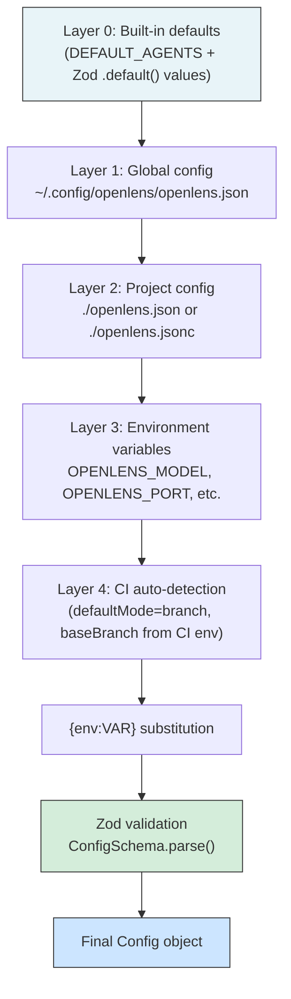

# Configuration

openlens uses a layered configuration system where each layer can override values from the previous one. Configuration is validated at load time using Zod schemas, and supports JSON with comments (JSONC), environment variable substitution, and CI auto-detection.

## Config File Locations and Layering

Configuration is resolved in `loadConfig()` ([src/config/config.ts:90-140](../src/config/config.ts)) through four layers, each deep-merged on top of the previous:



### Layer 0: Built-in Defaults

Four agents are registered by default ([src/config/config.ts:8-25](../src/config/config.ts)):

```typescript
const DEFAULT_AGENTS = {
  security: { description: "Security vulnerability scanner", prompt: "{file:agents/security.md}" },
  bugs:     { description: "Bug and logic error detector",   prompt: "{file:agents/bugs.md}" },
  performance: { description: "Performance issue finder",    prompt: "{file:agents/performance.md}" },
  style:    { description: "Style and convention checker",   prompt: "{file:agents/style.md}" },
}
```

Zod `.default()` values fill in any fields not explicitly set (e.g., `model` defaults to `"opencode/big-pickle"`).

### Layer 1: Global Config

Read from `~/.config/openlens/openlens.json`. Applies to all projects for this user.

### Layer 2: Project Config

Read from `./openlens.json` or `./openlens.jsonc` in the current working directory (first match wins). Both files support JSON with comments -- line comments (`//`) and block comments (`/* */`) are stripped before parsing ([src/config/config.ts:77-88](../src/config/config.ts)).

### Layer 3: Environment Variables

Specific environment variables override config values directly:

| Variable | Overrides | Example |
|----------|-----------|---------|
| `OPENLENS_MODEL` | `config.model` | `OPENLENS_MODEL=anthropic/claude-sonnet-4-20250514` |
| `OPENLENS_PORT` | `config.server.port` | `OPENLENS_PORT=8080` |

### Layer 4: CI Auto-detection

When running in a CI environment, two defaults are applied automatically ([src/config/config.ts:121-133](../src/config/config.ts)):

- `review.defaultMode` is set to `"branch"` (unless explicitly configured or `OPENLENS_MODE` is set)
- `review.baseBranch` is inferred from CI environment variables (unless `OPENLENS_BASE_BRANCH` is set)

### Environment Variable Substitution

After all layers are merged, any `{env:VAR}` patterns in string values are replaced with the corresponding environment variable value ([src/config/config.ts:27-30](../src/config/config.ts)):

```json
{
  "model": "{env:MY_MODEL_PROVIDER}/{env:MY_MODEL_ID}"
}
```

## Full ConfigSchema Reference

The complete `ConfigSchema` ([src/config/schema.ts:41-84](../src/config/schema.ts)):

| Field | Type | Default | Description |
|-------|------|---------|-------------|
| `$schema` | `string` | - | Optional JSON Schema URL for editor validation |
| `model` | `string` | `"opencode/big-pickle"` | Default LLM model for all agents |
| `agent` | `Record<string, AgentConfig>` | `{}` (merged with built-ins) | Per-agent configuration |
| `permission` | `Record<string, PermissionValue>` | - | Global tool permissions (agents inherit these) |
| `server.port` | `number` | `4096` | OpenCode server port |
| `server.hostname` | `string` | `"localhost"` | OpenCode server hostname |
| `review.defaultMode` | `"staged" \| "unstaged" \| "branch" \| "auto"` | `"staged"` | Which diff to review |
| `review.instructions` | `string[]` | `["REVIEW.md"]` | Additional instruction files to load |
| `review.baseBranch` | `string` | `"main"` | Base branch for `branch` mode diffs |
| `review.fullFileContext` | `boolean` | `true` | Include full source of changed files in prompts |
| `review.verify` | `boolean` | `true` | Run verification pass to filter false positives |
| `review.timeoutMs` | `number` | `180000` (3 min) | Per-agent session timeout |
| `review.maxConcurrency` | `number` | `4` | Maximum agents running in parallel |
| `review.minConfidence` | `"high" \| "medium" \| "low"` | `"medium"` | Minimum confidence threshold for reported issues |
| `review.rules.enabled` | `boolean` | `true` | Enable automatic rules discovery |
| `review.rules.extraFiles` | `string[]` | `[]` | Additional file names to search during rules discovery |
| `review.rules.include` | `string[]` | `[]` | Glob patterns for custom rules files |
| `review.rules.exclude` | `string[]` | `[]` | Glob patterns to exclude from rules discovery |
| `review.rules.maxDepth` | `number` | `20` | Maximum directories to walk up during discovery |
| `suppress.files` | `string[]` | `[]` | File glob patterns to suppress issues from |
| `suppress.patterns` | `string[]` | `[]` | Text patterns to suppress in issue titles/messages |
| `mcp` | `Record<string, McpServer>` | `{}` | MCP server configurations |
| `disabled_agents` | `string[]` | `[]` | Agent names to disable |

## AgentConfigSchema Reference

Per-agent config fields ([src/config/schema.ts:19-39](../src/config/schema.ts)):

| Field | Type | Default | Description |
|-------|------|---------|-------------|
| `description` | `string` | - | Human-readable description |
| `mode` | `"primary" \| "subagent" \| "all"` | `"subagent"` | Execution mode |
| `model` | `string` | Inherits global `model` | LLM model override |
| `prompt` | `string` | Built-in prompt | Inline prompt, `{file:path}`, or omit for built-in |
| `temperature` | `number` (0-1) | - | Sampling temperature |
| `top_p` | `number` (0-1) | - | Nucleus sampling parameter |
| `steps` | `integer` (>= 1) | `5` | Max agentic loop iterations |
| `disable` | `boolean` | `false` | Disable this agent |
| `hidden` | `boolean` | `false` | Hide from agent listings |
| `color` | `string` | - | ANSI color for CLI output |
| `fullFileContext` | `boolean` | Inherits `review.fullFileContext` | Full file context override |
| `context` | `"security" \| "bugs" \| "performance" \| "style"` | - | Auto-gather context strategy |
| `permission` | `Record<string, PermissionValue>` | - | Tool permission overrides |

## Review Options

### `defaultMode`

Controls which git diff is reviewed:

- **`staged`** (default) -- Only staged changes (`git diff --cached`)
- **`unstaged`** -- Only unstaged changes (`git diff`)
- **`branch`** -- All changes on current branch vs `baseBranch` (`git diff baseBranch...HEAD`)
- **`auto`** -- Tries staged first, then unstaged, then branch

### `verify`

When `true` (default), a verification agent re-examines all found issues after the initial review pass. The verifier groups issues by agent, checks for cross-agent agreement, and can boost or downgrade confidence. See [Review Pipeline](5-review-pipeline.md) for details.

### `fullFileContext`

When `true` (default), the full source of every changed file is included in the prompt alongside the diff. Files are truncated at 500 lines. Individual agents can override this with `fullFileContext: false` in their config.

### `minConfidence`

Issues below this threshold are filtered out before output. Uses a numeric ranking: `high=0`, `medium=1`, `low=2`. The default `"medium"` filters out only `low`-confidence issues.

### `timeoutMs`

Per-agent session timeout in milliseconds. Default is 180,000 ms (3 minutes). If an agent's session does not reach idle state within this time, it is aborted.

### `maxConcurrency`

Maximum number of agents running simultaneously. Agents are batched using `Promise.allSettled()` in groups of this size. Default is 4.

## Suppression Rules

Suppression allows hiding known false positives or irrelevant findings. Rules come from two sources ([src/suppress.ts:11-38](../src/suppress.ts)):

### Config-based Suppression

```json
{
  "suppress": {
    "files": ["**/*.test.ts", "migrations/**"],
    "patterns": ["TODO", "missing documentation"]
  }
}
```

- **`files`** -- Glob patterns matched against the issue's `file` field. Supports `*` (single segment) and `**` (any depth).
- **`patterns`** -- Case-insensitive substring matches against the issue's `title` and `message` fields.

### `.openlensignore` File

A file at the project root, one glob pattern per line. Lines starting with `#` are comments, empty lines are skipped. Each non-comment line becomes a file-type suppression rule ([src/suppress.ts:26-37](../src/suppress.ts)):

```gitignore
# Suppress issues in generated code
generated/**
proto/**/*.ts

# Suppress issues in vendored dependencies
vendor/**
```

### Matching Logic

The `shouldSuppress()` function checks each issue against all rules ([src/suppress.ts:51-71](../src/suppress.ts)):

- **File rules:** The issue's `file` field is matched against the glob pattern
- **Pattern rules:** The issue's `title` and `message` are checked for case-insensitive substring matches

## Rules Discovery

openlens automatically discovers project convention files and injects them into agent prompts. This is implemented in `discoverRules()` ([src/config/rules.ts:135-211](../src/config/rules.ts)).

### Well-known Files

The following files are searched in every directory from `cwd` up to the git repository root ([src/config/rules.ts:13-17](../src/config/rules.ts)):

- `AGENTS.md`
- `CLAUDE.md`
- `.openlens/rules.md`

### Discovery Algorithm

1. **Find repo root** -- Walk up from `cwd` looking for a `.git` directory
2. **Walk directories** -- Collect all directories from repo root down to `cwd` (root-first order so deeper files have higher priority)
3. **Check well-known files + extras** -- In each directory, look for well-known file names and any `extraFiles` from config
4. **Resolve glob patterns** -- If `include` patterns are configured, recursively walk the repo and match files (excluding `node_modules` and `.git`)
5. **Deduplicate** -- Files are tracked by absolute path; duplicates are skipped
6. **Format** -- Each discovered file becomes a section: `# From: <relativePath>\n\n<content>`, joined by `---` separators

### Configuration

```json
{
  "review": {
    "rules": {
      "enabled": true,
      "extraFiles": ["REVIEW_RULES.md", "CONVENTIONS.md"],
      "include": [".openlens/rules/*.md"],
      "exclude": ["**/draft-*.md"],
      "maxDepth": 20
    }
  }
}
```

## Environment Variables

### Direct Config Overrides

| Variable | Effect |
|----------|--------|
| `OPENLENS_MODEL` | Override `config.model` |
| `OPENLENS_PORT` | Override `config.server.port` |
| `OPENLENS_DEBUG` | Enable debug logging to stderr |
| `OPENCODE_BIN` | Explicit path to the `opencode` binary |

### `{env:VAR}` Substitution

Any string value in the config can reference environment variables:

```json
{
  "model": "{env:PROVIDER}/{env:MODEL_ID}",
  "agent": {
    "custom": {
      "prompt": "{file:{env:PROMPTS_DIR}/custom.md}"
    }
  }
}
```

The substitution happens after all config layers are merged but before Zod validation ([src/config/config.ts:136](../src/config/config.ts)).

## CI Auto-detection

The `detectCI()` function identifies six CI providers plus a generic fallback ([src/env.ts:11-32](../src/env.ts)):

| Provider | Detection | Base Branch Variable |
|----------|-----------|---------------------|
| GitHub Actions | `GITHUB_ACTIONS=true` | `GITHUB_BASE_REF` |
| GitLab CI | `GITLAB_CI=true` | `CI_MERGE_REQUEST_TARGET_BRANCH_NAME` |
| CircleCI | `CIRCLECI=true` | - |
| Buildkite | `BUILDKITE=true` | `BUILDKITE_PULL_REQUEST_BASE_BRANCH` |
| Jenkins | `JENKINS_URL` set | - |
| Travis CI | `TRAVIS=true` | - |
| Generic | `CI=true` or `CI=1` | - |

When CI is detected, `inferBaseBranch()` ([src/env.ts:70-85](../src/env.ts)) checks provider-specific environment variables to determine the target branch for diff comparison:

- **GitHub Actions:** `GITHUB_BASE_REF` (set on pull request events)
- **GitLab CI:** `CI_MERGE_REQUEST_TARGET_BRANCH_NAME`
- **Buildkite:** `BUILDKITE_PULL_REQUEST_BASE_BRANCH`

## MCP Server Configuration

External tool servers can be configured in the `mcp` section:

```json
{
  "mcp": {
    "my-tools": {
      "type": "local",
      "command": "npx",
      "args": ["my-mcp-server"],
      "environment": { "API_KEY": "{env:MY_API_KEY}" },
      "enabled": true
    },
    "remote-tools": {
      "type": "remote",
      "url": "https://mcp.example.com/sse",
      "enabled": true
    }
  }
}
```

The `McpServerSchema` ([src/config/schema.ts:3-10](../src/config/schema.ts)) supports both local (spawned subprocess) and remote (URL-based) servers. Each server can be individually disabled with `enabled: false`.

## Example Configurations

### Minimal (use all defaults)

```json
{}
```

Uses all four built-in agents with `opencode/big-pickle`, staged diff mode, verification enabled.

### Custom model with fewer agents

```json
{
  "model": "anthropic/claude-sonnet-4-20250514",
  "disabled_agents": ["style", "performance"],
  "review": {
    "verify": false,
    "minConfidence": "low"
  }
}
```

### CI pipeline configuration

```json
{
  "model": "opencode/big-pickle",
  "review": {
    "defaultMode": "branch",
    "baseBranch": "main",
    "maxConcurrency": 2,
    "timeoutMs": 300000
  },
  "suppress": {
    "files": ["**/*.test.ts", "**/*.spec.ts"],
    "patterns": ["TODO"]
  }
}
```

### Custom agent with write access

```json
{
  "agent": {
    "fixer": {
      "description": "Auto-fix agent with write permissions",
      "model": "anthropic/claude-sonnet-4-20250514",
      "prompt": "{file:.openlens/fixer.md}",
      "steps": 10,
      "permission": {
        "read": "allow",
        "grep": "allow",
        "glob": "allow",
        "edit": "allow",
        "write": "allow",
        "bash": "deny"
      }
    }
  }
}
```

### Primary orchestrator with subagents

```json
{
  "agent": {
    "orchestrator": {
      "description": "Primary review orchestrator",
      "mode": "primary",
      "model": "anthropic/claude-sonnet-4-20250514",
      "steps": 15
    },
    "security": { "mode": "subagent" },
    "bugs": { "mode": "subagent" },
    "performance": { "mode": "subagent" },
    "style": { "mode": "subagent" }
  }
}
```

When primary agents exist, they run instead of subagents and can delegate focused tasks to specialists via the `openlens-delegate` tool.

## Cross-references

- For how agents inherit and merge permissions, see [Agent System](3-agent-system.md)
- For how config feeds into the review pipeline execution, see [Review Pipeline](5-review-pipeline.md)

## Relevant source files

- [src/config/config.ts](../src/config/config.ts) - Config loading, layering, deep merge, and instruction loading
- [src/config/schema.ts](../src/config/schema.ts) - `ConfigSchema`, `AgentConfigSchema`, and all Zod validation
- [src/config/rules.ts](../src/config/rules.ts) - Rules discovery (AGENTS.md, CLAUDE.md, custom patterns)
- [src/env.ts](../src/env.ts) - CI detection, base branch inference, OpenCode binary resolution
- [src/suppress.ts](../src/suppress.ts) - Suppression rules loading and matching
- [src/agent/agent.ts](../src/agent/agent.ts) - Agent loading and permission merging
