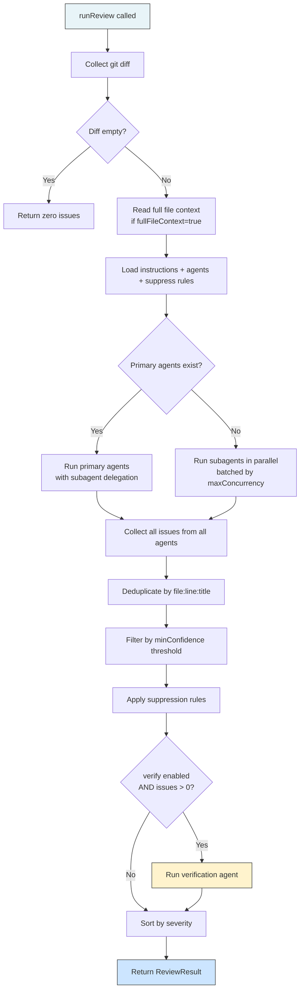
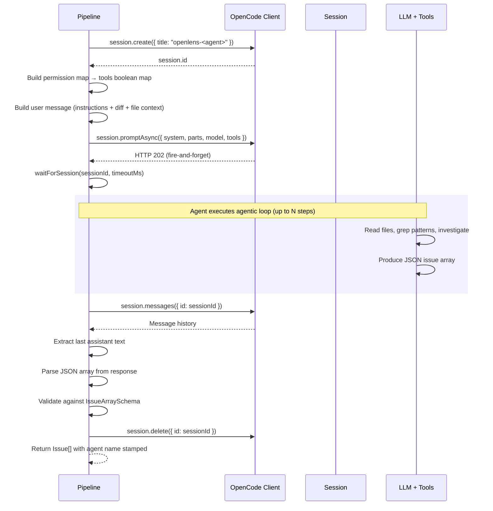
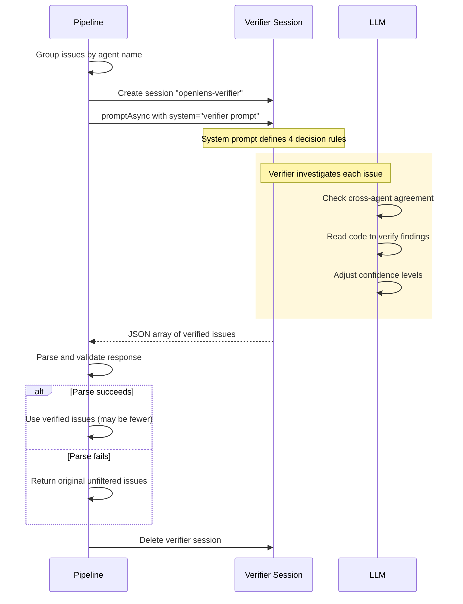

# Review Pipeline

The review pipeline orchestrates the entire code review process: collecting a diff, spawning or connecting to an OpenCode server, fanning out agent sessions in parallel, collecting and deduplicating results, filtering by confidence, applying suppression rules, and optionally running a verification pass.

## Full Pipeline Overview



## OpenCode Server Lifecycle

The pipeline requires a running OpenCode server to create sessions and run LLM prompts. The `getClient()` function handles this ([src/session/review.ts:721-757](../src/session/review.ts)):

1. **Try existing server** -- Attempts to connect to `http://{hostname}:{port}` and calls `client.app.agents()` as a health check
2. **Spawn new server** -- If no server is running, spawns `opencode serve --hostname=... --port=...` as a child process
3. **Wait for ready** -- Reads stdout line by line looking for `"opencode server listening on <url>"`. Times out after 5 seconds (15 seconds in CI)
4. **Connect MCP servers** -- If `config.mcp` has entries, connects them to the running server via `client.mcp.add()` and `client.mcp.connect()`
5. **Return cleanup function** -- If a server was spawned, the cleanup function kills the process when the review completes

The binary is resolved via `resolveOpencodeBin()` ([src/env.ts:42-65](../src/env.ts)) with priority: `OPENCODE_BIN` env var > bundled `node_modules/.bin/opencode` > global PATH.

## Single Agent Execution

Each agent runs through `runSingleAgent()` ([src/session/review.ts:378-467](../src/session/review.ts)):



### Session Creation

A new session is created for each agent with the title `openlens-<agentName>` ([src/session/review.ts:389-395](../src/session/review.ts)). Sessions are always cleaned up in a `finally` block via `session.delete()`.

### Permission-to-Tools Conversion

The agent's merged permission map is converted to a boolean tools map for the OpenCode SDK ([src/session/review.ts:140-148](../src/session/review.ts)):

```typescript
function permissionToTools(permission) {
  const tools = {}
  for (const [name, value] of Object.entries(permission)) {
    if (typeof value === "string") {
      tools[name] = value === "allow"  // "deny"/"ask" → false
    }
  }
  return tools
}
```

MCP tools are added if available and not explicitly denied by the agent. Primary agents additionally get `openlens-delegate`, `openlens-agents`, and `openlens-conventions` tools ([src/session/review.ts:401-416](../src/session/review.ts)).

### User Message Construction

The `buildUserMessage()` function assembles the prompt sent as the user message ([src/session/review.ts:66-116](../src/session/review.ts)). The agent's prompt from its markdown file is sent as the **system prompt** separately. The user message contains:

1. **Project-specific instructions** -- From discovered rules files and configured instruction files
2. **File context** -- Full source of changed files (if enabled) plus strategy-gathered context
3. **Diff** -- The actual diff in a fenced code block
4. **Tool instructions** -- Lists available tools and instructs the agent to investigate rather than guess
5. **Delegation instructions** (primary agents only) -- Lists available subagents with descriptions

### Response Parsing

After the session completes, `getSessionResponse()` walks the message history backwards to find the last assistant text ([src/session/review.ts:350-376](../src/session/review.ts)). Then `extractJsonArray()` extracts the JSON issue array using two patterns ([src/session/review.ts:118-137](../src/session/review.ts)):

1. Fenced code block: `` ```json ... ``` `` or `` ``` ... ``` ``
2. Bare JSON array: `[ ... ]`

The extracted array is validated against `IssueArraySchema`. If validation fails, a best-effort manual mapping is used as fallback, preserving as many fields as possible ([src/session/review.ts:442-457](../src/session/review.ts)).

## SSE Event Streaming

The `waitForSession()` function monitors a running session until it becomes idle ([src/session/review.ts:154-222](../src/session/review.ts)). It uses a two-tier approach:

### Primary: SSE Events

`waitViaSSE()` subscribes to the OpenCode event stream ([src/session/review.ts:266-344](../src/session/review.ts)):

1. Calls `client.event.subscribe()` to get a stream
2. Handles three possible stream types: `ReadableStream` (via `.getReader()`), `AsyncIterable` (via `for await`), or raw reader
3. For each event, checks if it matches the target session ID
4. Resolves when it sees `session.idle` or `session.status` with `type: "idle"` for the target session
5. While waiting, emits `agent.progress` bus events for tool usage and step completion via `emitProgress()` ([src/session/review.ts:225-263](../src/session/review.ts))

Progress events include:
- **Tool calls** -- e.g., `read src/auth.ts`, `grep "pattern"`, `glob src/**/*.ts`
- **Step start** -- `"thinking..."`
- **Step finish** -- Token count if available

### Fallback: Status Polling

If SSE is not available or fails, `waitForSession()` falls back to polling `client.session.status()` ([src/session/review.ts:185-218](../src/session/review.ts)):

- Initial delay: 300ms
- Exponential backoff: delay * 1.5 each iteration
- Maximum delay: 3000ms
- Polls until the session status is `"idle"` or the timeout is reached

### Timeout Handling

Both paths race against a timeout promise ([src/session/review.ts:167-175](../src/session/review.ts)). If the timeout fires first, the session is aborted via `client.session.abort()` and an error is thrown.

## Parallel Agent Execution

Agents are executed in batches controlled by `config.review.maxConcurrency` (default: 4) ([src/session/review.ts:919-967](../src/session/review.ts)):

```typescript
for (let i = 0; i < agents.length; i += concurrency) {
  const batch = agents.slice(i, i + concurrency)
  const batchResults = await Promise.allSettled(batch.map(async (agent) => {
    // ... run single agent
  }))
  results.push(...batchResults)
}
```

Each agent in a batch runs concurrently. `Promise.allSettled()` ensures that a failure in one agent does not abort the others. Failed agents increment the `agentsFailed` counter but do not block the pipeline.

Before each agent runs, its context strategy is evaluated via `gatherStrategyContext()` to augment the file context with domain-specific files. If the agent has `fullFileContext: false`, the global file context is excluded but strategy context is still included ([src/session/review.ts:932-936](../src/session/review.ts)).

### Primary vs Subagent Mode

If any agents have `mode: "primary"`, only those run at the top level. Primary agents receive the list of subagents and can delegate to them via the `openlens-delegate` tool ([src/session/review.ts:877-883](../src/session/review.ts)). If no primary agents exist, all subagents (mode `"subagent"` or `"all"`) run directly in parallel.

## Deduplication

After all agents complete, issues are deduplicated by `dedup()` ([src/session/review.ts:559-572](../src/session/review.ts)):

- **Key:** `file:line:endLine:title` (title lowercased, truncated to 60 chars)
- **Conflict resolution:** When two issues share a key, the one with higher severity wins (using rank: `critical=0`, `warning=1`, `info=2`)

## Confidence Filtering

`filterByConfidence()` removes issues below the configured threshold ([src/session/review.ts:574-582](../src/session/review.ts)):

```typescript
const CONFIDENCE_RANK = { high: 0, medium: 1, low: 2 }
// Issues with rank > threshold rank are filtered out
```

With the default `minConfidence: "medium"`, only `low`-confidence issues are removed.

## Suppression

After confidence filtering, suppression rules are applied ([src/session/review.ts:990-997](../src/session/review.ts)). Rules are loaded from `config.suppress.files`, `config.suppress.patterns`, and `.openlensignore`. See [Configuration - Suppression Rules](4-configuration.md#suppression-rules) for details.

The suppression count is tracked in `meta.suppressed` so consumers know how many issues were hidden.

## Verification Pass

When `config.review.verify` is `true` and there are issues remaining after dedup/confidence/suppression, a verification agent runs ([src/session/review.ts:470-557](../src/session/review.ts)):



### Verifier Decision Rules

The verifier's system prompt defines four rules ([src/session/review.ts:489-503](../src/session/review.ts)):

1. If **multiple agents** flag the same file+line, boost confidence to `"high"`
2. If **only one agent** flags something at `"low"` confidence, remove it unless confirmed by reading code
3. The verifier may upgrade or downgrade confidence based on its own investigation
4. Use tools (read, grep, glob, list) to verify -- check actual code, imports, context

### Failure Handling

If the verifier fails (timeout, parse error, etc.), the original unfiltered issues are returned unchanged ([src/session/review.ts:546-549](../src/session/review.ts)). This ensures the verification pass is purely additive -- it can only improve results, never cause data loss.

## Event Bus Integration

The pipeline publishes lifecycle events via the event bus throughout execution ([src/session/review.ts:916, 928, 951, 961, 1019](../src/session/review.ts)):

| Event | Payload | When |
|-------|---------|------|
| `review.started` | `{ agents: string[] }` | Before agent execution begins |
| `agent.started` | `{ name: string }` | When an agent begins (including verifier) |
| `agent.progress` | `{ name, kind, detail }` | During SSE streaming -- tool calls and step updates |
| `agent.completed` | `{ name, issueCount, time }` | When an agent finishes successfully |
| `agent.failed` | `{ name, error }` | When an agent fails |
| `review.completed` | `{ issueCount, time }` | After all processing is complete |

These events power the CLI's live progress display and are available to library consumers.

## Result Structure

The pipeline returns a `ReviewResult` ([src/types.ts:33-48](../src/types.ts)):

```typescript
{
  issues: Issue[],          // Sorted by severity (critical → warning → info)
  timing: {                 // Per-agent wall-clock time in ms
    security: 12500,
    bugs: 8200,
    // ...
  },
  meta: {
    mode: "staged",         // Resolved diff mode
    filesChanged: 5,        // Number of files in the diff
    agentsRun: 4,           // Number of agents that executed
    agentsFailed: 0,        // Number of agents that errored
    suppressed: 2,          // Number of issues hidden by suppression
    verified: true,         // Whether verification pass ran
  }
}
```

## Delegated Reviews

`runSingleAgentReview()` ([src/session/review.ts:760-826](../src/session/review.ts)) provides a simplified pipeline for running a single agent with a focused question. This is used by the `openlens-delegate` tool when a primary agent delegates to a specialist. It follows the same server lifecycle and session creation but skips dedup, suppression, and verification.

## Cross-references

- For agent configuration, permissions, and context strategies, see [Agent System](3-agent-system.md)
- For config loading, suppression rules, and CI detection, see [Configuration](4-configuration.md)

## Relevant source files

- [src/session/review.ts](../src/session/review.ts) - Full pipeline implementation (1040 lines)
- [src/agent/agent.ts](../src/agent/agent.ts) - Agent loading and filtering
- [src/tool/diff.ts](../src/tool/diff.ts) - Git diff collection
- [src/config/config.ts](../src/config/config.ts) - Instruction loading
- [src/suppress.ts](../src/suppress.ts) - Suppression rule matching
- [src/context/strategy.ts](../src/context/strategy.ts) - Context strategy file gathering
- [src/bus/index.ts](../src/bus/index.ts) - Event bus for lifecycle events
- [src/env.ts](../src/env.ts) - OpenCode binary resolution and CI detection
- [src/types.ts](../src/types.ts) - `IssueSchema`, `IssueArraySchema`, `ReviewResultSchema`
