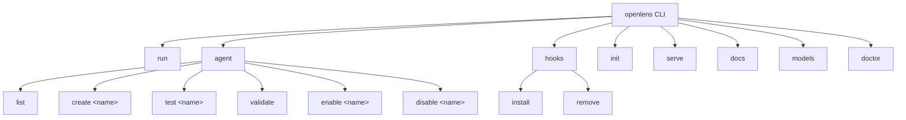

# CLI Reference

**Relevant source files:**
- [src/index.ts](https://github.com/Traves-Theberge/OpenLens/blob/main/src/index.ts)
- [src/env.ts](https://github.com/Traves-Theberge/OpenLens/blob/main/src/env.ts)
- [src/config/config.ts](https://github.com/Traves-Theberge/OpenLens/blob/main/src/config/config.ts)

This page documents every command, flag, environment variable, and exit code for the `openlens` CLI. The CLI is built with [yargs](https://yargs.js.org/) and serves as the primary interface for running AI-powered code reviews.

## Command Overview

| Command | Description |
|---------|-------------|
| `openlens run` | Run AI code review on your changes (staged, unstaged, or branch diff) |
| `openlens agent list` | Show all configured agents with their models, permissions, and steps |
| `openlens agent create <name>` | Scaffold a new agent with prompt template and config entry |
| `openlens agent test <name>` | Run a single agent against current changes to debug or iterate on its prompt |
| `openlens agent validate` | Check all agent configs for errors (missing prompts, bad models, no tools) |
| `openlens agent enable <name>` | Re-enable a previously disabled agent in openlens.json |
| `openlens agent disable <name>` | Disable an agent so it will not run during reviews |
| `openlens hooks install` | Install git hooks (pre-commit + pre-push) for automatic review |
| `openlens hooks remove` | Remove git hooks and restore backups |
| `openlens init` | Set up OpenLens in your project (creates openlens.json and agents/ directory) |
| `openlens serve` | Start an HTTP API server for running reviews programmatically |
| `openlens models` | List all available AI models from OpenCode (free and paid) |
| `openlens docs` | Serve the wiki locally with dark theme and mermaid diagram support |
| `openlens doctor` | Diagnose your setup -- checks git, opencode binary, API keys, config, and agents |



## openlens run

Run AI code review on your changes. This is the primary command. It loads config, resolves agents, collects a diff, runs agents in parallel, optionally verifies results, and outputs formatted findings.

### Flags

| Flag | Type | Default | Description |
|------|------|---------|-------------|
| `--staged` | boolean | — | Review staged changes (git add) |
| `--unstaged` | boolean | — | Review unstaged changes |
| `--branch <name>` | string | — | Review diff against the named branch |
| `--agents <list>` | string | — | Comma-separated agent whitelist (e.g. `security,bugs`) |
| `--exclude-agents <list>` | string | — | Comma-separated agents to skip |
| `-m, --model <model>` | string | — | Override model for all agents (e.g. `opencode/big-pickle`) |
| `-f, --format <fmt>` | choice | `text` | Output format: `text`, `json`, `sarif`, `markdown` |
| `--verify` / `--no-verify` | boolean | `true` | Run verification pass. Use `--no-verify` to skip |
| `--context` / `--no-context` | boolean | `true` | Include full file context. Use `--no-context` for diff only |
| `--dry-run` | boolean | — | Show what would run without making API calls |

### Diff Mode Resolution

If no mode flag is given, the CLI falls back to `config.review.defaultMode` (which defaults to `"staged"`). The resolution order is:

1. `--unstaged` flag sets mode to `"unstaged"`
2. `--branch <name>` flag sets mode to `"branch"` and overrides `config.review.baseBranch`
3. `--staged` flag sets mode to `"staged"`
4. Otherwise, use `config.review.defaultMode`

Source: [src/index.ts, lines 131-140](https://github.com/Traves-Theberge/OpenLens/blob/main/src/index.ts#L131-L140)

### Dry Run

With `--dry-run`, the command prints a plan without making any API calls:

- Mode and number of files changed
- List of changed files (up to 10, then a summary)
- Number of active agents with their models, steps, and allowed tools
- MCP servers, verify/context settings, timeout, and output format

Source: [src/index.ts, lines 143-205](https://github.com/Traves-Theberge/OpenLens/blob/main/src/index.ts#L143-L205)

### Progress Streaming

When the output format is `text`, the CLI subscribes to the event bus and streams progress to stderr:

- `review.started` -- prints agent count
- `agent.started` -- prints agent name
- `agent.progress` -- prints tool calls and step completions
- `agent.completed` -- prints issue count and elapsed time
- `agent.failed` -- prints error message

Source: [src/index.ts, lines 208-229](https://github.com/Traves-Theberge/OpenLens/blob/main/src/index.ts#L208-L229)

### Examples

```bash
openlens run --staged                     # Review staged changes
openlens run --branch main                # Review all changes vs main branch
openlens run --agents security,bugs       # Run only specific agents
openlens run --format sarif               # Output SARIF for GitHub Code Scanning
openlens run --dry-run --staged           # Preview without running
openlens run --no-verify --no-context     # Fast run: skip verification and full file context
openlens run -m anthropic/claude-sonnet   # Override model for all agents
```

## openlens agent

Manage review agents. This is a command group with six subcommands.

### agent list

Show all configured agents with their models, permissions, steps, mode, and description.

```bash
openlens agent list
```

### agent create \<name\>

Scaffold a new agent. Creates an `agents/<name>.md` file with YAML frontmatter and a prompt template, and optionally updates `openlens.json`.

| Flag | Type | Default | Description |
|------|------|---------|-------------|
| `--description` | string | `"<name> code reviewer"` | Agent description |
| `--model` | string | `"opencode/big-pickle"` | Model to use |
| `--steps` | number | `5` | Max agentic loop iterations |

Agent names must match the pattern `^[a-z][a-z0-9-]*$` (lowercase alphanumeric with hyphens).

```bash
openlens agent create api-review --description "REST API reviewer" --steps 8
```

Source: [src/index.ts, lines 303-434](https://github.com/Traves-Theberge/OpenLens/blob/main/src/index.ts#L303-L434)

### agent test \<name\>

Run a single agent against current changes for debugging and prompt iteration.

| Flag | Type | Default | Description |
|------|------|---------|-------------|
| `--staged` | boolean | — | Review staged changes |
| `--unstaged` | boolean | — | Review unstaged changes |
| `--branch <name>` | string | — | Review diff against branch |
| `--format` | choice | `text` | Output format: `text`, `json` |
| `-m, --model` | string | — | Override model |
| `--verbose` | boolean | `true` | Show timing and metadata |

```bash
openlens agent test security --staged
openlens agent test bugs --branch main --format json
```

### agent validate

Check all agent configurations for errors. Validates:

- Prompt file exists and has content (not just frontmatter)
- YAML frontmatter parses correctly
- Model has a provider prefix (e.g. `anthropic/...`)
- Steps is at least 1
- At least one tool is allowed
- MCP server configs have required fields

Exits with code 1 if any errors are found.

```bash
openlens agent validate
```

### agent enable \<name\>

Re-enable a previously disabled agent. Removes the agent from `disabled_agents` array and deletes `disable: true` from the agent config in `openlens.json`.

```bash
openlens agent enable style
```

### agent disable \<name\>

Disable an agent by setting `disable: true` in its config entry in `openlens.json`.

```bash
openlens agent disable style
```

## openlens hooks

Manage git hooks for automatic code review on commit and push.

### hooks install

Install `pre-commit` and `pre-push` hooks into the current repository. Existing hooks are backed up with a `.backup` suffix.

| Flag | Type | Default | Description |
|------|------|---------|-------------|
| `--global` | boolean | — | Install to `~/.config/openlens/hooks` and set `core.hooksPath` globally |

```bash
openlens hooks install
openlens hooks install --global
```

The `pre-commit` hook runs security and bugs agents on staged changes (~15s). The `pre-push` hook runs all agents against the full branch diff (~60s). Both block on critical issues (exit code 1).

Install is idempotent — safe to run multiple times.

Skip hooks for a single operation with `OPENLENS_SKIP=1`:

```bash
OPENLENS_SKIP=1 git commit -m "wip"
OPENLENS_SKIP=1 git push
```

### hooks remove

Remove installed hooks and restore any backups.

```bash
openlens hooks remove
```

## openlens init

Set up OpenLens in a project. Creates:

1. An `agents/` directory with four default agent prompts: `security.md`, `bugs.md`, `performance.md`, `style.md` (copied from the bundled templates)
2. An `openlens.json` config file with default settings

Existing files are not overwritten. The default config sets:
- Model: `opencode/big-pickle`
- Default mode: `staged`
- Instructions: `["REVIEW.md"]`
- Full file context and verification enabled

Source: [src/index.ts, lines 744-825](https://github.com/Traves-Theberge/OpenLens/blob/main/src/index.ts#L744-L825)

```bash
openlens init
```

## openlens serve

Start an HTTP API server powered by Hono. See [Integrations > HTTP Server](8-integrations.md#http-server) for endpoint details.

| Flag | Type | Default | Description |
|------|------|---------|-------------|
| `--port` | number | `4096` (from config) | Port to listen on |
| `--hostname` | string | `localhost` (from config) | Hostname to bind to |

CLI flags override values from `config.server`. The server uses `@hono/node-server` when available, falling back to `Bun.serve` when running under Bun.

```bash
openlens serve                          # Default: localhost:4096
openlens serve --port 8080 --hostname 0.0.0.0
```

Source: [src/index.ts, lines 828-874](https://github.com/Traves-Theberge/OpenLens/blob/main/src/index.ts#L828-L874)

## openlens models

List all available AI models from OpenCode. Shells out to the `opencode models` command. Also shows the currently configured model from `openlens.json`.

```bash
openlens models
```

Source: [src/index.ts, lines 876-908](https://github.com/Traves-Theberge/OpenLens/blob/main/src/index.ts#L876-L908)

## openlens docs

Serve the OpenLens wiki locally. Launches a local HTTP server with dark theme styling and mermaid diagram rendering.

```bash
openlens docs
```

## openlens doctor

Diagnose your environment. Checks in order:

1. **git** -- verifies git is installed and shows version
2. **opencode** -- verifies the OpenCode binary is reachable and shows version/path
3. **API keys** -- checks for `ANTHROPIC_API_KEY` and `OPENAI_API_KEY` (optional, free models work without them)
4. **config** -- loads and validates `openlens.json`, shows the configured model
5. **agents** -- loads all agents, validates model prefixes, prompts, and tool permissions
6. **MCP servers** -- counts enabled MCP servers
7. **CI detection** -- identifies CI environment if running in one

Exits with code 1 if any errors are found.

```bash
openlens doctor
```

Source: [src/index.ts, lines 910-1014](https://github.com/Traves-Theberge/OpenLens/blob/main/src/index.ts#L910-L1014)

## Exit Codes

| Code | Meaning |
|------|---------|
| `0` | Success -- review completed with no critical issues |
| `1` | Review completed but critical issues were found |
| `2` | Fatal error -- invalid config, not a git repo, missing binary, etc. |

The `fatal()` helper function in `src/index.ts` prints the error to stderr and exits with code 2. The `run` command exits with code 1 when any issue has `severity: "critical"`.

Source: [src/index.ts, lines 24-27 and 253-256](https://github.com/Traves-Theberge/OpenLens/blob/main/src/index.ts#L24-L27)

## Environment Variables

### Configuration Overrides

These are consumed during config loading and override corresponding config file values:

| Variable | Description |
|----------|-------------|
| `OPENLENS_MODE` | Override default review mode (`staged`, `unstaged`, `branch`, `auto`) |
| `OPENLENS_AGENTS` | Comma-separated agent whitelist (also used by git hooks to select agents) |
| `OPENLENS_SKIP` | Set to `1` to skip OpenLens git hooks for a single operation |
| `OPENLENS_FORMAT` | Override output format |
| `OPENLENS_BASE_BRANCH` | Override base branch for branch mode |
| `OPENLENS_VERIFY` | Set to `"false"` to skip verification |
| `OPENLENS_CONFIG` | Path to a specific config file |
| `OPENLENS_MODEL` | Override model for all agents |

### API Keys

| Variable | Description |
|----------|-------------|
| `ANTHROPIC_API_KEY` | Required only when using Anthropic models |
| `OPENAI_API_KEY` | Required only when using OpenAI models |

### Runtime

| Variable | Description |
|----------|-------------|
| `NO_COLOR` | Disable ANSI color output when set to any value |
| `OPENCODE_BIN` | Explicit path to the `opencode` binary (overrides auto-detection) |

### CI Detection

The following environment variables are read by `detectCI()` in [src/env.ts](https://github.com/Traves-Theberge/OpenLens/blob/main/src/env.ts) to identify CI providers:

| Variable | Provider |
|----------|----------|
| `GITHUB_ACTIONS=true` | GitHub Actions |
| `GITLAB_CI=true` | GitLab CI |
| `CIRCLECI=true` | CircleCI |
| `BUILDKITE=true` | Buildkite |
| `JENKINS_URL` | Jenkins (presence check) |
| `TRAVIS=true` | Travis CI |

Base branch inference (for `branch` mode in CI):

| Variable | Provider |
|----------|----------|
| `GITHUB_BASE_REF` | GitHub Actions PR target branch |
| `CI_MERGE_REQUEST_TARGET_BRANCH_NAME` | GitLab MR target branch |
| `BUILDKITE_PULL_REQUEST_BASE_BRANCH` | Buildkite PR target branch |

Source: [src/env.ts](https://github.com/Traves-Theberge/OpenLens/blob/main/src/env.ts)

## Global Flags

| Flag | Description |
|------|-------------|
| `-h, --help` | Show help |
| `-v, --version` | Show version (currently `0.2.0`) |
