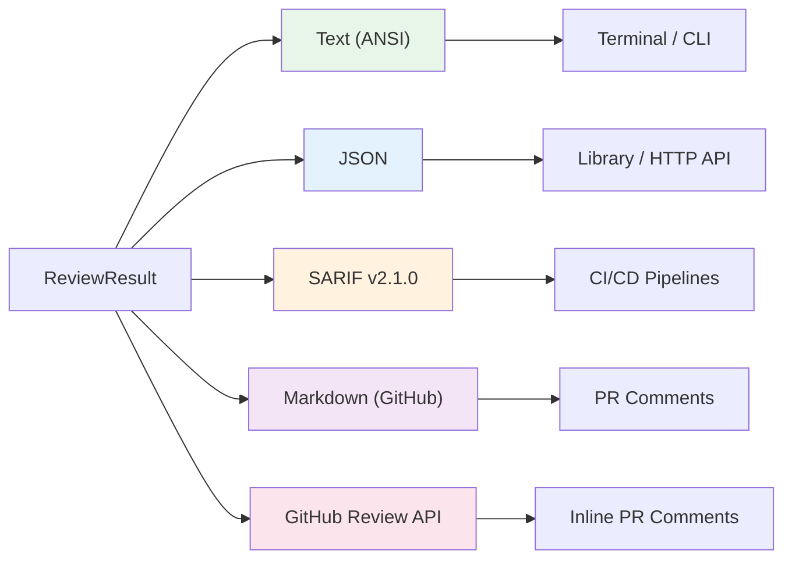
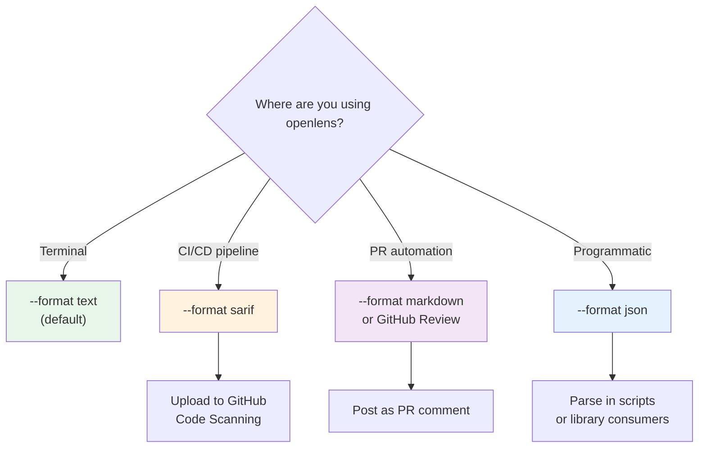

# Output Formats

openlens supports five output formats, each designed for a different consumption context. This page covers the structure, features, and usage of each format.



## Core Data Model

All formats render a `ReviewResult` object defined in [src/types.ts](https://github.com/Traves-Theberge/OpenLens/blob/main/src/types.ts):

```typescript
interface ReviewResult {
  issues: Issue[]
  timing: Record<string, number>  // agent name → milliseconds
  meta?: {
    mode: string
    filesChanged: number
    agentsRun: number
    agentsFailed: number
    suppressed: number
    verified: boolean
  }
}

interface Issue {
  file: string
  line: number
  endLine?: number
  severity: "critical" | "warning" | "info"
  agent: string
  title: string
  message: string
  fix?: string
  patch?: string
  confidence: "high" | "medium" | "low"   // default: "high"
}
```

## Text Format

**Used by:** CLI (`--format text`, the default)

The text formatter produces ANSI-colored terminal output with severity labels, file locations, agent attribution, and optional fix suggestions and patches.

### Color Support

Colors are controlled by the `NO_COLOR` environment variable. When `NO_COLOR` is set to any value, all ANSI escape codes are suppressed.

| Severity | Color | Label |
|----------|-------|-------|
| critical | Red | `CRITICAL` |
| warning | Yellow | `WARNING` |
| info | Blue | `INFO` |

Source: [src/output/format.ts, lines 1-20](https://github.com/Traves-Theberge/OpenLens/blob/main/src/output/format.ts#L1-L20)

### Structure

Each issue is rendered as:

```
  CRITICAL  src/auth.ts:42  [security]
  SQL injection in user query
  Raw user input concatenated into SQL string without parameterization
  → Use parameterized queries instead of string concatenation
  patch:
    -const q = `SELECT * FROM users WHERE id = '${id}'`
    +const q = `SELECT * FROM users WHERE id = $1`
```

Non-high confidence issues include a confidence annotation: `CRITICAL (medium confidence)`.

The footer shows a summary of issue counts by severity, timing per agent, suppressed count, and verification status.

When no issues are found, the output is:

```
  openlens  No issues found. (3 files, 4 agents, verified)
```

### Progress Streaming

In text mode, the CLI subscribes to the event bus and streams real-time progress to the terminal before the final output:

- Agent start/completion indicators with timing
- Tool call and step progress
- Failure messages

Source: [src/index.ts, lines 208-229](https://github.com/Traves-Theberge/OpenLens/blob/main/src/index.ts#L208-L229)

## JSON Format

**Used by:** Library API, HTTP server, programmatic consumers (`--format json`)

The JSON formatter outputs the raw `ReviewResult` object serialized as pretty-printed JSON (`JSON.stringify(result, null, 2)`).

Source: [src/output/format.ts, lines 132-134](https://github.com/Traves-Theberge/OpenLens/blob/main/src/output/format.ts#L132-L134)

### Example Output

```json
{
  "issues": [
    {
      "file": "src/auth.ts",
      "line": 42,
      "severity": "critical",
      "agent": "security",
      "title": "SQL injection in user query",
      "message": "Raw user input concatenated into SQL string without parameterization.",
      "fix": "Use parameterized queries instead of string concatenation",
      "confidence": "high",
      "patch": "-const q = `SELECT * FROM users WHERE id = '${id}'`\n+const q = `SELECT * FROM users WHERE id = $1`"
    }
  ],
  "timing": {
    "security": 4521,
    "bugs": 3892,
    "performance": 2100,
    "style": 1800
  },
  "meta": {
    "mode": "staged",
    "filesChanged": 3,
    "agentsRun": 4,
    "agentsFailed": 0,
    "suppressed": 1,
    "verified": true
  }
}
```

## SARIF v2.1.0 Format

**Used by:** GitHub Code Scanning, CI/CD pipelines (`--format sarif`)

The SARIF formatter produces a [SARIF v2.1.0](https://docs.oasis-open.org/sarif/sarif/v2.1.0/sarif-v2.1.0.html) compliant document for integration with static analysis tools and GitHub's Code Scanning feature.

Source: [src/output/format.ts, lines 137-210](https://github.com/Traves-Theberge/OpenLens/blob/main/src/output/format.ts#L137-L210)

### Schema Mapping

| openlens Field | SARIF Field | Notes |
|----------------|-------------|-------|
| `issue.severity` | `result.level` | `critical` -> `error`, `warning` -> `warning`, `info` -> `note` |
| `issue.confidence` | `result.rank` | `high` -> `90.0`, `medium` -> `50.0`, `low` -> `10.0` |
| `issue.confidence` | `result.properties.confidence` | Raw confidence string |
| `issue.agent` | `result.ruleId` | Prefixed as `openlens/<agent>` |
| `issue.file` | `artifactLocation.uri` | Relative file path |
| `issue.line` | `region.startLine` | 1-based line number |
| `issue.endLine` | `region.endLine` | Optional end line |
| `issue.patch` | `fixes[0]` | Mapped to SARIF fix with `artifactChanges` and `replacements` |

### Structure

```json
{
  "version": "2.1.0",
  "$schema": "https://raw.githubusercontent.com/oasis-tcs/sarif-spec/main/sarif-2.1/schema/sarif-schema-2.1.0.json",
  "runs": [
    {
      "tool": {
        "driver": {
          "name": "openlens",
          "version": "0.2.0",
          "informationUri": "https://github.com/Traves-Theberge/OpenLens",
          "rules": [
            {
              "id": "openlens/security",
              "shortDescription": { "text": "openlens security agent" }
            }
          ]
        }
      },
      "results": [
        {
          "ruleId": "openlens/security",
          "level": "error",
          "message": { "text": "SQL injection in user query\n\nDetailed explanation...\n\nFix: Use parameterized queries" },
          "locations": [
            {
              "physicalLocation": {
                "artifactLocation": { "uri": "src/auth.ts" },
                "region": { "startLine": 42 }
              }
            }
          ],
          "rank": 90.0,
          "properties": { "confidence": "high" }
        }
      ]
    }
  ]
}
```

### Rules Deduplication

Agent names are deduplicated into SARIF rules using `new Set(result.issues.map(i => i.agent))`, so each agent appears exactly once in the `rules` array regardless of how many issues it found.

### Fix Mapping

When an issue includes a `patch` field, the SARIF output includes a `fixes` array with `artifactChanges` containing `replacements` that specify the `deletedRegion` (from `line` to `endLine`) and `insertedContent` (the patch text).

## Markdown Format

**Used by:** GitHub PR comments (`--format markdown`)

The Markdown formatter produces GitHub-flavored Markdown with a summary table, collapsible file sections, and linked source locations.

Source: [src/output/format.ts, lines 212-387](https://github.com/Traves-Theberge/OpenLens/blob/main/src/output/format.ts#L212-L387)

### Features

- **Comment marker:** Every output starts with `<!-- openlens-review -->` for finding/updating existing comments on re-runs
- **Summary table:** Severity counts in a Markdown table with emoji indicators
- **Collapsible file groups:** Issues grouped by file inside `<details>` blocks
- **Source links:** When `repo` and `sha` options are provided, file references become clickable GitHub links with line ranges
- **Confidence labels:** Non-high confidence issues include `(medium confidence)` or `(low confidence)` annotations
- **Diff patches:** Included in fenced code blocks with `diff` syntax highlighting
- **Timing footer:** Collapsible section showing per-agent timing
- **Truncation:** Output is truncated at 60,000 characters (GitHub comment limit) with a warning footer

### Markdown Options

```typescript
interface MarkdownOptions {
  repo?: string   // e.g. "owner/repo" for GitHub links
  sha?: string    // commit SHA for permalink generation
}
```

When run in GitHub Actions, the CLI automatically passes `GITHUB_REPOSITORY` and `GITHUB_SHA`.

### Example Output

```markdown
<!-- openlens-review -->
## :mag: openlens Review -- 3 issues found

| Severity | Count |
|----------|-------|
| :red_circle: Critical | 1 |
| :yellow_circle: Warning | 2 |

> 5 files changed . 4 agents . verified

---

<details>
<summary><b>src/auth.ts</b> (2 issues)</summary>

:red_circle: **Critical**: SQL injection in user query
[src/auth.ts:42](https://github.com/owner/repo/blob/abc123/src/auth.ts#L42) | `security`

Raw user input concatenated into SQL string.

> **Fix:** Use parameterized queries

</details>
```

## GitHub Review Format

**Used by:** GitHub Actions inline PR comments

The GitHub Review formatter converts review results into a GitHub Pull Request Review API payload with inline comments on specific lines.

Source: [src/output/github-review.ts](https://github.com/Traves-Theberge/OpenLens/blob/main/src/output/github-review.ts)

### Review Event Mapping

| Condition | Event |
|-----------|-------|
| Any critical issue | `REQUEST_CHANGES` |
| Issues found, none critical | `COMMENT` |
| No issues | `APPROVE` |

Note: In the GitHub Actions workflow, `APPROVE` is replaced with `COMMENT` since Actions bots typically lack approval permissions.

### Inline Comments

Each issue becomes a `GitHubReviewComment`:

```typescript
interface GitHubReviewComment {
  path: string        // file path
  line: number        // end line (or single line)
  start_line?: number // start line for multi-line ranges
  body: string        // formatted comment body
}
```

Comment body format:

```
**CRITICAL** -- SQL injection in user query

Raw user input concatenated into SQL string.

**Fix:** Use parameterized queries

```diff
-const q = `SELECT * FROM users WHERE id = '${id}'`
+const q = `SELECT * FROM users WHERE id = $1`
```

_Agent: security_
```

GitHub limits reviews to 50 inline comments, so the action slices comments at that boundary.

### Fingerprinting

Issues are fingerprinted using a SHA-256 hash of `file + title + agent` (excluding line number). This enables:

- **Incremental updates:** On re-runs, only new issues get new comments
- **Auto-resolve:** Previously reported issues that no longer appear are struck through with "Resolved in latest push"
- **Progress tracking:** The summary shows counts of resolved, new, and remaining issues

The fingerprint is computed as:

```typescript
sha256(`${issue.file}\x00${issue.title}\x00${issue.agent}`).slice(0, 16)
```

Line numbers are intentionally excluded so that issues survive code movement (e.g., adding lines above a flagged function).

Source: [src/output/github-review.ts, lines 18-23](https://github.com/Traves-Theberge/OpenLens/blob/main/src/output/github-review.ts#L18-L23)

### Fingerprint State Persistence

The GitHub Actions workflow stores fingerprints in a hidden comment on the PR:

```
<!-- openlens-review-state: <base64-encoded-JSON> -->
```

On subsequent runs, the workflow reads this state to determine which issues are resolved, new, or remaining. Previous `REQUEST_CHANGES` reviews are dismissed before submitting new ones to avoid stale blocks.

Source: [action.yml, Post PR Review step](https://github.com/Traves-Theberge/OpenLens/blob/main/action.yml#L228-L533)

## Format Selection Guide



| Format | Best For | CLI Flag | Programmatic Function |
|--------|----------|----------|-----------------------|
| Text | Terminal use, human reading | `--format text` | `formatText(result)` |
| JSON | Library consumers, scripts, HTTP API | `--format json` | `formatJson(result)` |
| SARIF | GitHub Code Scanning, CI tools | `--format sarif` | `formatSarif(result)` |
| Markdown | PR comments, issue tracking | `--format markdown` | `formatMarkdown(result, options?)` |
| GitHub Review | Inline PR comments (Actions only) | N/A (via action.yml) | `formatGitHubReview(result)` |

## Cross-references

- [CLI Reference](6-cli-reference.md) for `--format` flag usage
- [Integrations](8-integrations.md) for GitHub Actions SARIF upload and inline comment workflows

## Relevant source files

- [src/output/format.ts](https://github.com/Traves-Theberge/OpenLens/blob/main/src/output/format.ts)
- [src/output/github-review.ts](https://github.com/Traves-Theberge/OpenLens/blob/main/src/output/github-review.ts)
- [src/types.ts](https://github.com/Traves-Theberge/OpenLens/blob/main/src/types.ts)
