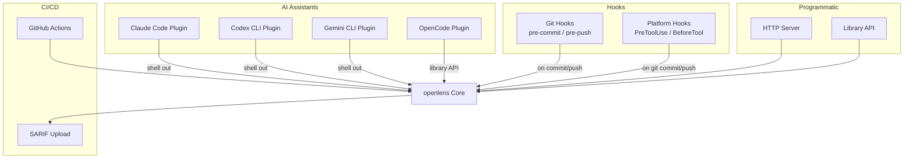
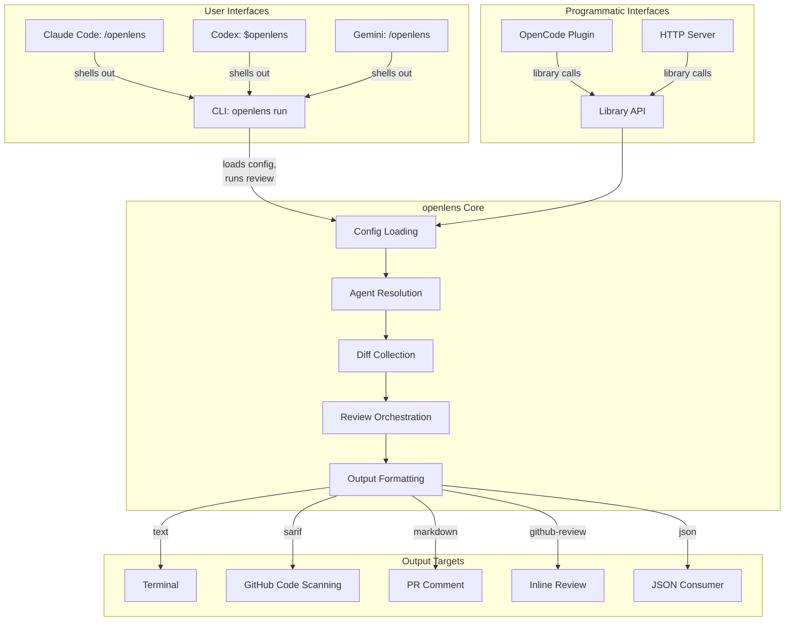

# Integrations

openlens integrates with CI/CD systems, AI coding assistants, and programmatic consumers through multiple interfaces. This page covers every integration point.



## GitHub Actions

openlens ships as a composite GitHub Action defined in [action.yml](https://github.com/Traves-Theberge/OpenLens/blob/main/action.yml).

### Inputs

| Input | Default | Description |
|-------|---------|-------------|
| `mode` | `branch` | Review mode: `staged`, `unstaged`, `branch`, `auto` |
| `agents` | all | Comma-separated agent names |
| `format` | `sarif` | Output format: `text`, `json`, `sarif`, `markdown` |
| `base-branch` | `main` | Base branch for branch mode diff |
| `verify` | `true` | Run verification pass |
| `config` | — | Path to openlens.json config file |
| `upload-sarif` | `true` | Upload SARIF to GitHub Code Scanning |
| `fail-on-critical` | `true` | Fail the workflow if critical issues are found |
| `model` | — | Override model (default: `opencode/big-pickle`) |
| `anthropic-api-key` | — | Anthropic API key (only for Anthropic models) |
| `openai-api-key` | — | OpenAI API key (only for OpenAI models) |
| `comment-on-pr` | `false` | Post review results as a PR comment |
| `inline-comments` | `true` | Post inline review comments on specific lines (requires `comment-on-pr`) |
| `auto-resolve` | `true` | Resolve previous comments that are now fixed on re-runs |

### Outputs

| Output | Description |
|--------|-------------|
| `issues` | Number of issues found |
| `critical` | Number of critical issues found |
| `sarif-file` | Path to SARIF output file |

### Workflow Steps

The action runs as a composite action with these steps:

1. **Setup Bun** -- installs Bun runtime via `oven-sh/setup-bun@v2`
2. **Install openlens** -- runs `bun install --frozen-lockfile`
3. **Verify OpenCode binary** -- checks `node_modules/.bin/opencode` exists
4. **Run openlens** -- executes the review with configured flags, writes SARIF and step summary
5. **Upload SARIF** -- uploads to GitHub Code Scanning via `github/codeql-action/upload-sarif@v3`
6. **Generate JSON review** -- (conditional) re-runs with `--format json` when inline comments are enabled
7. **Post PR Review** -- (conditional) posts inline review comments via GitHub API

Source: [action.yml](https://github.com/Traves-Theberge/OpenLens/blob/main/action.yml)

### Inline Comments and Incremental Updates

When `comment-on-pr` and `inline-comments` are both enabled, the action:

1. Runs a second review pass with `--format json` to get structured issue data
2. Computes SHA-256 fingerprints for each issue (using `file + title + agent`, excluding line numbers)
3. Reads previous fingerprints from a hidden state comment (`<!-- openlens-review-state: ... -->`)
4. Computes resolved, new, and remaining issues
5. **Auto-resolve:** strikes through resolved inline comments with "Resolved in latest push"
6. **Dismiss stale reviews:** dismisses previous `REQUEST_CHANGES` reviews
7. **Post new review:** submits a PR review with up to 50 inline comments
8. **Save state:** updates the fingerprint state comment for the next run

The progress summary in the review body shows: `openlens found 5 issue(s) across 3 files. (2 resolved, 1 new, 2 remaining)`

### Required Permissions

```yaml
permissions:
  contents: read
  pull-requests: write
  security-events: write    # for SARIF upload
```

### Example Usage

Minimal setup (from [.github/workflows/pr-review.yml](https://github.com/Traves-Theberge/OpenLens/blob/main/.github/workflows/pr-review.yml)):

```yaml
name: openlens PR Review

on:
  pull_request:
    types: [opened, synchronize, reopened]

permissions:
  contents: read
  pull-requests: write
  security-events: write

jobs:
  review:
    runs-on: ubuntu-latest
    steps:
      - uses: actions/checkout@v4
        with:
          fetch-depth: 0

      - name: Fetch base branch
        run: git fetch origin ${{ github.base_ref }}:${{ github.base_ref }}

      - uses: ./
        with:
          mode: branch
          base-branch: ${{ github.base_ref }}
          comment-on-pr: "true"
          inline-comments: "true"
          auto-resolve: "true"
          upload-sarif: "true"
          fail-on-critical: "true"
```

## Claude Code Plugin

**File:** [plugins/claude-code/SKILL.md](https://github.com/Traves-Theberge/OpenLens/blob/main/plugins/claude-code/SKILL.md)

A Claude Code slash command that runs openlens from within a Claude Code session. It shells out to the `openlens` CLI.

### Usage

```
/openlens                           # Review staged changes (default)
/openlens --unstaged                # Review unstaged changes
/openlens --branch main             # Review diff against a branch
/openlens --agents security,bugs    # Run specific agents only
/openlens --no-verify               # Skip verification pass
```

### How It Works

The SKILL.md file instructs Claude Code to execute:

```bash
openlens run --staged --format text
```

User-provided flags (e.g., `--unstaged`, `--branch main`) are passed through to the CLI. The full text output is shown to the user, and Claude Code offers to help fix any issues found.

## Codex CLI Plugin

**File:** [plugins/codex/SKILL.md](https://github.com/Traves-Theberge/OpenLens/blob/main/plugins/codex/SKILL.md)

A Codex CLI skill that triggers on natural language phrases like "review my code", "check for vulnerabilities", or "security scan". It shells out to the `openlens` CLI.

### Trigger Phrases

The skill description includes trigger keywords: `"openlens"`, `"code review"`, `"review my changes"`, `"check for bugs"`, `"security scan"`, `"review staged"`.

### Usage Mappings

| User Intent | CLI Command |
|-------------|-------------|
| Default review | `openlens run --staged --format text` |
| "review against main" | `openlens run --branch main --format text` |
| "just check security" | `openlens run --staged --agents security --format text` |
| "review unstaged" | `openlens run --unstaged --format text` |
| "skip verification" | `openlens run --staged --no-verify --format text` |
| "json output" | `openlens run --staged --format json` |

### Result Interpretation

The SKILL.md provides severity guidance:
- **CRITICAL** -- must fix before merging
- **WARNING** -- should fix, potential problems
- **INFO** -- style or convention suggestions

## Gemini CLI Plugin

**File:** [plugins/gemini/openlens.toml](https://github.com/Traves-Theberge/OpenLens/blob/main/plugins/gemini/openlens.toml)

A Gemini CLI tool registration file in TOML format. Uses shell command interpolation to run openlens.

### Configuration

```toml
description = "Run openlens AI code review on current changes"

prompt = """
Run an openlens code review. Analyze the results and present them clearly to the user.

{{args}}

Review output:
!{openlens run --staged --format json}

Summarize the issues found by severity. For each issue show the file, line, severity, title,
and suggested fix. If no issues were found, say so.
"""
```

The `!{...}` syntax executes the command and injects its output into the prompt. The `{{args}}` placeholder passes through user arguments. Gemini then summarizes the JSON output for the user.

## OpenCode Plugin

**File:** [src/plugin.ts](https://github.com/Traves-Theberge/OpenLens/blob/main/src/plugin.ts)

A native [OpenCode](https://opencode.ai) plugin that registers four tools and two hooks. Unlike the other plugins, this one uses the library API directly rather than shelling out to the CLI.

### Registered Tools

| Tool | Description |
|------|-------------|
| `openlens` | Run a full code review on current changes with all agents |
| `openlens-delegate` | Delegate a focused review question to a specific specialist agent |
| `openlens-conventions` | Get project review conventions from AGENTS.md, CLAUDE.md, etc. |
| `openlens-agents` | List all available agents and their capabilities |

### openlens Tool

```typescript
args: {
  mode?: "staged" | "unstaged" | "branch" | "auto"   // default: "staged"
  agents?: string          // comma-separated agent names
  branch?: string          // base branch for branch mode
  verify?: boolean         // default: true
}
```

Calls `runReview()` directly and returns `formatText()` output.

### openlens-delegate Tool

```typescript
args: {
  agent: string     // required: agent name (e.g. "security")
  question: string  // required: specific focus question
  files?: string    // comma-separated file paths
}
```

Calls `runSingleAgentReview()` to run one agent with a targeted question. Returns an error message with available agents if the named agent is not found.

### openlens-conventions Tool

No arguments. Calls `loadInstructions()` to gather project conventions from discovered rules files and config.

### openlens-agents Tool

No arguments. Lists all agents with their description, model, allowed tools, and step count.

### Hooks

| Hook | Behavior |
|------|----------|
| `permission.ask` | Auto-approves read-only tools (`read`, `grep`, `glob`, `list`, `lsp`, `skill`, `view`, `find`, `diagnostics`) for sessions with titles starting with `openlens-` |
| `chat.params` | Sets temperature to `0` for deterministic results on sessions with `openlens-` prefixed titles |

### Package Export

The plugin is exported as `openlens/plugin` from `package.json`:

```typescript
import plugin from "openlens/plugin"
```

Source: [src/plugin.ts](https://github.com/Traves-Theberge/OpenLens/blob/main/src/plugin.ts)

## HTTP Server

**File:** [src/server/server.ts](https://github.com/Traves-Theberge/OpenLens/blob/main/src/server/server.ts)

A Hono-based HTTP API server started via `openlens serve`. All endpoints return JSON.

### Endpoints

| Method | Path | Description |
|--------|------|-------------|
| `GET` | `/` | Server info: name and version |
| `POST` | `/review` | Run a code review |
| `GET` | `/agents` | List all configured agents |
| `GET` | `/config` | Show current config (MCP secrets redacted) |
| `GET` | `/diff` | Get diff stats for a given mode |
| `GET` | `/health` | Health check (`{"status": "ok"}`) |

### POST /review

Request body (all fields optional):

```json
{
  "mode": "staged",
  "agents": ["security", "bugs"],
  "branch": "main",
  "verify": false,
  "fullFileContext": false
}
```

Returns a full `ReviewResult` JSON object.

Valid modes: `staged`, `unstaged`, `branch`, `auto`. Invalid values fall back to `config.review.defaultMode`.

### GET /agents

Returns an array of agent objects:

```json
[
  {
    "name": "security",
    "description": "Security vulnerability scanner",
    "model": "opencode/big-pickle",
    "mode": "subagent",
    "steps": 5,
    "fullFileContext": true,
    "permission": { "read": "allow", "grep": "allow", ... }
  }
]
```

### GET /config

Returns the current configuration with sensitive data redacted. MCP server configs are reduced to `{ type, enabled }` to prevent token leakage.

### GET /diff

Query parameters:
- `mode` -- `staged`, `unstaged`, or `branch` (default: `staged`)

Returns diff statistics:

```json
{
  "mode": "staged",
  "stats": { "filesChanged": 3, "files": ["src/a.ts", "src/b.ts", "src/c.ts"] }
}
```

### Starting the Server

```bash
openlens serve                             # localhost:4096
openlens serve --port 8080 --hostname 0.0.0.0
```

See [CLI Reference > openlens serve](6-cli-reference.md#openlens-serve).

## Library API

**File:** [src/lib.ts](https://github.com/Traves-Theberge/OpenLens/blob/main/src/lib.ts)

The library API is the main `openlens` package export for programmatic use.

### Exports

| Export | Category | Description |
|--------|----------|-------------|
| `runReview` | Review | Run a full multi-agent review |
| `runSingleAgentReview` | Review | Run one agent with a targeted question |
| `filterByConfidence` | Review | Filter issues by minimum confidence |
| `loadConfig` | Config | Load layered configuration |
| `loadInstructions` | Config | Load project review instructions |
| `discoverRules` | Config | Walk directories for rules files |
| `formatDiscoveredRules` | Config | Format discovered rules for prompts |
| `gatherStrategyContext` | Context | Auto-gather files per context strategy |
| `loadAgents` | Agent | Load and resolve all agents |
| `filterAgents` | Agent | Filter agents by whitelist |
| `excludeAgents` | Agent | Exclude agents by name |
| `getDiff` | Diff | Get diff for a specific mode |
| `getAutoDetectedDiff` | Diff | Auto-detect diff mode |
| `getDiffStats` | Diff | Parse diff statistics |
| `formatText` | Output | Format as ANSI text |
| `formatJson` | Output | Format as JSON |
| `formatSarif` | Output | Format as SARIF v2.1.0 |
| `formatMarkdown` | Output | Format as GitHub Markdown |
| `formatGitHubReview` | Output | Format as GitHub Review payload |
| `loadSuppressRules` | Suppress | Load suppression rules |
| `shouldSuppress` | Suppress | Check if an issue should be suppressed |
| `createBus` / `bus` | Events | Event bus for lifecycle events |
| `createServer` | Server | Create Hono server instance |
| `detectCI` | Env | Detect CI environment |
| `resolveOpencodeBin` | Env | Resolve opencode binary path |
| `inferBaseBranch` | Env | Infer base branch from CI env vars |

### Type Exports

```typescript
import type {
  Issue,
  ReviewResult,
  Config,
  AgentConfig,
  Agent,
  ReviewEvents,
  SuppressRule,
  MarkdownOptions,
  GitHubReview,
  GitHubReviewComment,
  RulesDiscoveryConfig,
  DiscoveredRule,
} from "openlens"
```

### Example Usage

```typescript
import {
  loadConfig,
  loadAgents,
  runReview,
  formatText,
  formatSarif,
} from "openlens"

// Load config from current directory
const config = await loadConfig(process.cwd())

// Run review
const result = await runReview(config, "staged", process.cwd())

// Format output
console.log(formatText(result))

// Or get SARIF for CI
const sarif = formatSarif(result)
```

## Integration Architecture



## Platform Hooks

openlens ships platform-specific hook configurations in the `hooks/` directory. These hooks trigger openlens reviews automatically on **git commit and push only** (not on file writes or other tool events).

| File | Platform | Trigger |
|------|----------|---------|
| `hooks/claude-code-hooks.json` | Claude Code | Git commit and push |
| `hooks/gemini-hooks.json` | Gemini CLI | Git commit and push |
| `hooks/codex-hooks.json` | Codex CLI | Git commit and push |
| `hooks/opencode-hooks.ts` | OpenCode | Git commit and push |

### Claude Code Hooks

Install by copying or symlinking `hooks/claude-code-hooks.json` to your project. Claude Code will run openlens automatically when you commit or push.

### Codex CLI Hooks

Uses `.codex/hooks.json` (JSON format). Copy `hooks/codex-hooks.json` to `.codex/hooks.json` in your project.

### Gemini CLI Hooks

Copy `hooks/gemini-hooks.json` to your Gemini CLI configuration directory.

### OpenCode Hooks

The `hooks/opencode-hooks.ts` file registers TypeScript hook handlers for the OpenCode runtime.

### Skipping Hooks

Set `OPENLENS_SKIP=1` to bypass hooks for a single operation:

```bash
OPENLENS_SKIP=1 git commit -m "wip"
OPENLENS_SKIP=1 git push
```

Use `OPENLENS_AGENTS` to control which agents run during hook execution:

```bash
OPENLENS_AGENTS=security,bugs git commit -m "quick check"
```

## The `using-openlens` Skill

openlens ships a `using-openlens` skill that teaches AI agents how to use the CLI effectively. It is installed automatically by `openlens setup --plugins` alongside the platform slash command.

### What it provides

- Workflow guidance: which commands to run and when
- Output interpretation: severity levels, confidence scores, exit codes
- Decision logic: fix critical issues, triage warnings, note informational findings
- Targeted reviews: when to use `openlens agent test <name>`

### Install locations

| Platform    | Path                                  |
|-------------|---------------------------------------|
| Claude Code | `~/.claude/skills/using-openlens/`    |
| Codex CLI   | `~/.codex/skills/using-openlens/`     |

The skill source lives in `skills/using-openlens/SKILL.md` and is included in the npm package.

## Cross-references

- [CLI Reference](6-cli-reference.md) for all command flags
- [Output Formats](7-output-formats.md) for format details and examples
- [Testing](9-testing.md) for server endpoint tests and E2E CLI tests

## Relevant source files

- [action.yml](https://github.com/Traves-Theberge/OpenLens/blob/main/action.yml)
- [.github/workflows/pr-review.yml](https://github.com/Traves-Theberge/OpenLens/blob/main/.github/workflows/pr-review.yml)
- [plugins/claude-code/SKILL.md](https://github.com/Traves-Theberge/OpenLens/blob/main/plugins/claude-code/SKILL.md)
- [plugins/codex/SKILL.md](https://github.com/Traves-Theberge/OpenLens/blob/main/plugins/codex/SKILL.md)
- [plugins/gemini/openlens.toml](https://github.com/Traves-Theberge/OpenLens/blob/main/plugins/gemini/openlens.toml)
- [src/plugin.ts](https://github.com/Traves-Theberge/OpenLens/blob/main/src/plugin.ts)
- [src/server/server.ts](https://github.com/Traves-Theberge/OpenLens/blob/main/src/server/server.ts)
- [src/lib.ts](https://github.com/Traves-Theberge/OpenLens/blob/main/src/lib.ts)
