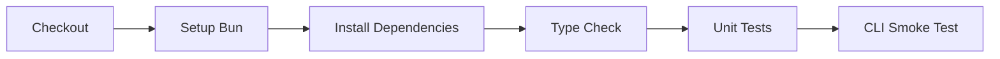

# Testing

This page covers openlens's testing strategy, the three test tiers, helper utilities, CI workflow, and how to run tests locally.

## Test Runner

openlens uses [Bun's built-in test runner](https://bun.sh/docs/cli/test) (`bun:test`). No additional test frameworks are needed.

```bash
bun test                              # Run all tests
bun test test/unit/config.test.ts     # Run a single test file
```

## Three-Tier Testing Strategy

```mermaid
graph TB
    subgraph "Tier 1: Unit Tests"
        U1[config.test.ts]
        U2[config-load.test.ts]
        U3[agent.test.ts]
        U4[diff.test.ts]
        U5[format.test.ts]
        U6[github-review.test.ts]
        U7[suppress.test.ts]
        U8[suppress-load.test.ts]
        U9[env.test.ts]
        U10[confidence.test.ts]
        U11[context-strategy.test.ts]
        U12[review-helpers.test.ts]
        U13[server.test.ts]
    end

    subgraph "Tier 2: Integration Tests"
        I1[review.test.ts]
    end

    subgraph "Tier 3: E2E Tests"
        E1[cli.test.ts]
        E2[run.test.ts]
        E3[agent.test.ts]
        E4[config.test.ts]
        E5[doctor.test.ts]
        E6[init.test.ts]
        E7[serve.test.ts]
        E8[v2-features.test.ts]
        E9[hooks.test.ts]
        E10[docs.test.ts]
    end

    U1 & U2 & U3 & U4 & U5 & U6 & U7 & U8 & U9 & U10 & U11 & U12 & U13 -.->|"fast, isolated"| Core[openlens Core Modules]
    I1 -.->|"real orchestration"| Core
    E1 & E2 & E3 & E4 & E5 & E6 & E7 & E8 & E9 & E10 -.->|"subprocess + temp git repos"| CLI[openlens CLI Binary]
```



### Tier 1: Unit Tests

Located in `test/unit/`. These tests are fast and isolated, testing individual modules with direct function calls. No external processes or API calls.

| Test File | Module Under Test | What It Covers |
|-----------|------------------|----------------|
| `config.test.ts` | `src/config/schema.ts` | Zod schema validation for config and agent config |
| `config-load.test.ts` | `src/config/config.ts` | Layered config resolution, file loading, env var overrides |
| `agent.test.ts` | `src/agent/agent.ts` | Agent loading, prompt resolution, frontmatter parsing, permission merging |
| `diff.test.ts` | `src/tool/diff.ts` | Diff parsing, stats extraction, mode detection |
| `format.test.ts` | `src/output/format.ts` | Text, JSON, SARIF, and Markdown output formatting |
| `github-review.test.ts` | `src/output/github-review.ts` | GitHub Review payload generation, fingerprinting, comment formatting |
| `suppress.test.ts` | `src/suppress.ts` | Suppression rule matching (file globs, text patterns) |
| `suppress-load.test.ts` | `src/suppress.ts` | Loading suppression rules from config and .openlensignore |
| `env.test.ts` | `src/env.ts` | CI detection, base branch inference, opencode binary resolution |
| `confidence.test.ts` | `src/session/review.ts` | Confidence filtering (`filterByConfidence`) |
| `context-strategy.test.ts` | `src/context/strategy.ts` | Context strategy file gathering per strategy type |
| `review-helpers.test.ts` | `src/session/review.ts` | Review helper functions |
| `server.test.ts` | `src/server/server.ts` | HTTP server endpoints (GET /, POST /review, GET /agents, etc.) |

### Tier 2: Integration Tests

Located in `test/integration/`. These tests exercise the full review workflow including config loading, agent resolution, and review orchestration.

| Test File | What It Covers |
|-----------|----------------|
| `review.test.ts` | Full review workflow end-to-end through the library API |

### Tier 3: E2E Tests

Located in `test/e2e/`. These tests run the actual `openlens` CLI as a subprocess against temporary git repositories. They verify the full stack from CLI argument parsing through to output formatting.

| Test File | What It Covers |
|-----------|----------------|
| `cli.test.ts` | Basic CLI behavior: `--help`, `--version`, unknown commands |
| `run.test.ts` | `openlens run` command: staged/unstaged/branch modes, format flags, dry-run |
| `agent.test.ts` | `openlens agent` subcommands: list, create, test, validate, enable, disable |
| `config.test.ts` | Config loading from different locations, env var overrides |
| `doctor.test.ts` | `openlens doctor` command output and exit codes |
| `init.test.ts` | `openlens init` project scaffolding |
| `serve.test.ts` | `openlens serve` HTTP server startup and endpoint responses |
| `v2-features.test.ts` | Newer features: confidence filtering, context strategies, verification |
| `hooks.test.ts` | `openlens hooks install/remove`: creates hooks, idempotent, backup/restore, errors |
| `docs.test.ts` | `openlens docs --help`: verifies command exists with correct options |

## E2E Test Helpers

The `test/e2e/helpers.ts` file provides utilities for creating isolated test environments.

Source: [test/e2e/helpers.ts](https://github.com/Traves-Theberge/OpenLens/blob/main/test/e2e/helpers.ts)

### Functions

| Function | Description |
|----------|-------------|
| `run(args, cwd, env?)` | Execute the openlens CLI with given arguments in a working directory. Uses `bun run src/index.ts`. Returns `{ stdout, stderr, exitCode }`. Timeout: 30 seconds. Disables CI auto-detection. |
| `createTempGitRepo()` | Create a temporary directory with an initialized git repo (initial commit, user config, GPG signing disabled). Returns the directory path. |
| `addStagedFile(dir, name, content)` | Write a file and `git add` it. Creates parent directories as needed. |
| `addUnstagedFile(dir, name, content)` | Write a file without staging it. |
| `addModifiedFile(dir, name, before, after)` | Commit a file with `before` content, then modify it to `after` and stage the modification. Useful for testing diffs. |
| `writeConfig(dir, config)` | Write an `openlens.json` file into the directory. |
| `writeAgent(dir, name, content)` | Write an agent markdown file into `agents/<name>.md`. |
| `cleanup(dir)` | Remove a temporary directory (best-effort). |

### RunResult Interface

```typescript
interface RunResult {
  stdout: string
  stderr: string
  exitCode: number | null
}
```

### Environment Isolation

The `run()` helper sets specific environment variables to ensure deterministic test output:

```typescript
{
  NO_COLOR: "1",        // Disable ANSI colors
  CI: "",               // Prevent CI auto-detection
  GITHUB_ACTIONS: "",   // Prevent GitHub Actions detection
  GITLAB_CI: "",        // Prevent GitLab CI detection
  ...env,               // Allow overrides per test
}
```

Source: [test/e2e/helpers.ts, lines 18-44](https://github.com/Traves-Theberge/OpenLens/blob/main/test/e2e/helpers.ts#L18-L44)

## CI Workflow

The CI pipeline is defined in [.github/workflows/ci.yml](https://github.com/Traves-Theberge/OpenLens/blob/main/.github/workflows/ci.yml) and runs on pushes to `main` and pull requests targeting `main`.



### Steps

| Step | Command | Purpose |
|------|---------|---------|
| Checkout | `actions/checkout@v4` | Clone the repository |
| Setup Bun | `oven-sh/setup-bun@v2` | Install Bun runtime |
| Install | `bun install --frozen-lockfile` | Install dependencies (locked) |
| Type check | `bun run typecheck` | Run `tsc --noEmit` in strict mode |
| Unit tests | `bun test` | Run all test files |
| CLI smoke test | Multiple commands | Verify CLI basics work |

### Smoke Test Commands

The CI smoke test runs these commands to verify the CLI is functional:

```bash
bun run src/index.ts --help
bun run src/index.ts --version
bun run src/index.ts agent list
bun run src/index.ts agent validate
bun run src/index.ts doctor
bun run src/index.ts run --dry-run --staged
```

Source: [.github/workflows/ci.yml, lines 31-37](https://github.com/Traves-Theberge/OpenLens/blob/main/.github/workflows/ci.yml#L31-L37)

## Running Tests Locally

### All Tests

```bash
bun test
```

### Single Test File

```bash
bun test test/unit/config.test.ts
bun test test/e2e/cli.test.ts
```

### Type Check Only

```bash
bun run typecheck
```

### Smoke Test (manual)

```bash
bun run src/index.ts --help
bun run src/index.ts run --dry-run --staged
bun run src/index.ts doctor
```

## Test File Listing

### Unit Tests (test/unit/)

```
test/unit/agent.test.ts
test/unit/config.test.ts
test/unit/config-load.test.ts
test/unit/confidence.test.ts
test/unit/context-strategy.test.ts
test/unit/diff.test.ts
test/unit/env.test.ts
test/unit/format.test.ts
test/unit/github-review.test.ts
test/unit/review-helpers.test.ts
test/unit/server.test.ts
test/unit/suppress.test.ts
test/unit/suppress-load.test.ts
```

### Integration Tests (test/integration/)

```
test/integration/review.test.ts
```

### E2E Tests (test/e2e/)

```
test/e2e/agent.test.ts
test/e2e/cli.test.ts
test/e2e/config.test.ts
test/e2e/doctor.test.ts
test/e2e/init.test.ts
test/e2e/run.test.ts
test/e2e/serve.test.ts
test/e2e/v2-features.test.ts
test/e2e/hooks.test.ts
test/e2e/docs.test.ts
test/e2e/helpers.ts          # shared test utilities (not a test file)
```

## Cross-references

- [CLI Reference](6-cli-reference.md) for the commands tested in E2E and smoke tests
- [Integrations > HTTP Server](8-integrations.md#http-server) for the endpoints tested in `test/unit/server.test.ts`

## Relevant source files

- [test/e2e/helpers.ts](https://github.com/Traves-Theberge/OpenLens/blob/main/test/e2e/helpers.ts)
- [.github/workflows/ci.yml](https://github.com/Traves-Theberge/OpenLens/blob/main/.github/workflows/ci.yml)
- [test/unit/](https://github.com/Traves-Theberge/OpenLens/tree/main/test/unit)
- [test/integration/](https://github.com/Traves-Theberge/OpenLens/tree/main/test/integration)
- [test/e2e/](https://github.com/Traves-Theberge/OpenLens/tree/main/test/e2e)
